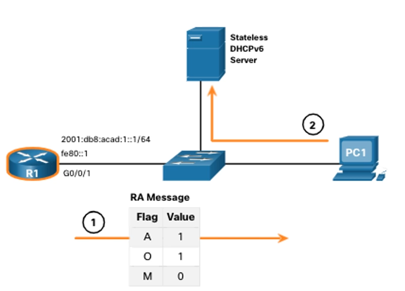
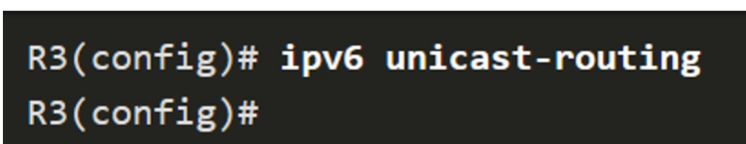
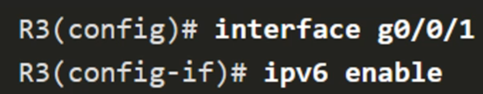
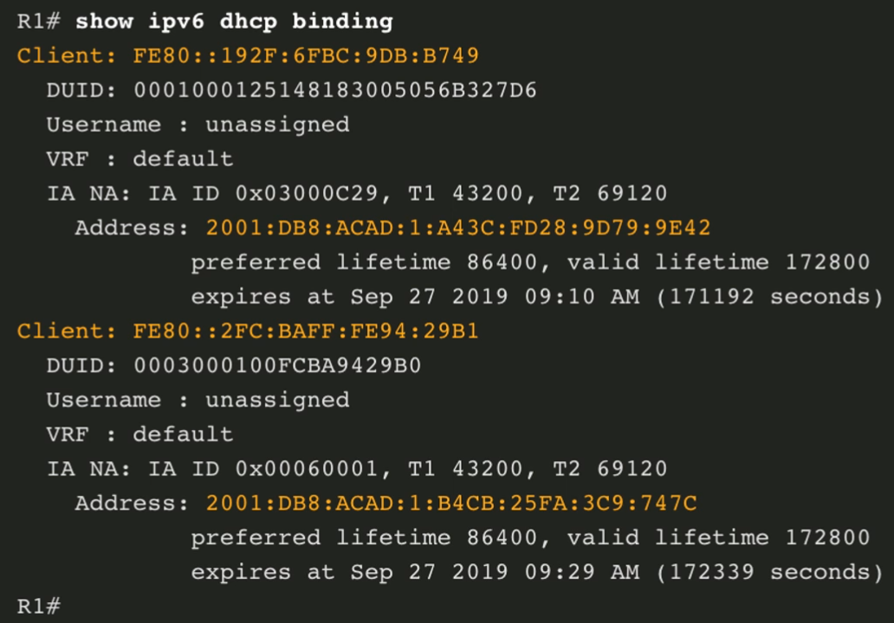

# DHCP
## DHCP_v4

### Клиент серверная модель DHCP


DHCP работает по клиент-серверной модели, где клиент отправляет запросы серверу dhcp, а затем dhcp предоставляет свои услуги клиенту

### Получение IP Адреса


DHCP используется для получения сетевых настроек клиентом.  
  
Чтобы это произошло, клиенту, который впервые подключается к сети и настроенному для автоматической настройки сетевого интерфейса, нужно отправить в сеть сообщение __DHCP DISCOVER__, чтобы найти DHCP сервер  
  


Если в локальной сети клиента существует DHCP сервер, то он отправляет DHCP OFFER на unicast либо broadcast адрес с предложением сетевых настроек    
  

Клиент отвечает на оффер сообщением DHCP Request, если он принимает настройки dhcp сервера, отправляя его на broadcast адрес  
  


Сервер подтверждает настройки клиента с помощью DHCP ACK. Может быть разослан как на Unicast, так и на Broadcast адреса  
  
__Таким образом у клиента в сети появляется:__
1. IP адрес
2. маска сети 
3. шлюз по умолчанию 
4. и прочие сетевые настройки по типу адреса DNS сервера, доменного имени

### Продление аренды IP адреса


Все IP адреса выдаются DHCP сервером на время, называемое __Временем аренды__. Это делается для того, чтобы мертвые клиенты, которые единожды подключились к сети и после этого перестали ей пользоваться, не занимали выделенные адреса.  

По истечению времени аренды, если клиент хочет продолжать пользоваться ip адресом, ему необходимо продлить аренду. Продление аренды происходит в 2 этапа:
1. Клиент отправляет DHCP серверу сообщение __DHCPREQUEST__ на Unicast адрес(т.к клиент знает, у какого DHCP сервера он брал IP адрес ) с просьбой продлить старый адрес.
2. Если это возможно, то сервер отправляет __DHCP ACK__, подтверждая продление 

### Команды настройки

В больших сетях рекомендуется использовать выделенный DHCP сервер, который будет обслуживать клиентов сети  
В малых сетях DHCP сервер можно настроить и на маршрутизаторе, локальном для этой сети

* на первом этапе нужно исключить некоторые ip адреса, такими адреса могут быть определены строго заданными настройками на какое-то оборудование клиента в сети либо на сетевое оборудование.
* Например это могут быть адреса, выделенные для шлюза по умолчанию для этой сети, принтеров, серверов, которые дожны иметь фиксированный постоянный адрес. 

__Исключить IPv4 адреса__
> R(config)# ip dhcp excluded-address _low_address_ [_high\_address_] 
> > С помощью этой команды можно исключить один адрес (если указываем только один адрес) либо целый диапозон адресов (при указании _low_address_ и _high\_address_)

* После исключения ненужных IP адресов, нужно задать пул адресов, которые будут выдаваться клиентам

__Создать пул DHCP__
> R(config)# ip dhcp pool _pool\_name_

* В режиме dhcp-config(перешли туда через предыдущую команду) можем задать пул адресов с помощью network. Указываем целый диапозон адресов

__Задать пул адресов__
> R(dhcp-config)# network _network-number_ [_mask_ &nbsp; | &nbsp; / _prefix-legnth_]

* Также стоит указать адрес маршрутизатора, который будет играть роль шлюза по умолчанию. Можно задать до 8 адресов за раз

__Задать маршрутизатор или шлюз по умолчанию__
> R(dhcp-config)# default-router _address_ &nbsp; [ address2 ... addres8 ]

* Дальше можно задать время аренды ip адресов. По умолчанию адреса выдаются на сутки

**Задать время аренды IP-адреса**
> R(dhcp-config)# lease *{days [hours [minutes]]* &nbsp; | &nbsp; *infinite}*

### Пример настройки DHCP сервера


### Проверка настроек DHCP сервера
Во-первых можно использовать **команду просмотра конфигурации**, чтобы убедиться, что были использованы все нужные команды


Чтобы проверить роботоспособность сервера, **можно посмотреть привязки выданных IP адресов к MAC адресам клиентов** 


Также можно посмотреть **статистику DHCP сервера**, чтобы посмотреть кол-во пакетов, которые были получены и переданы данным сервером


Чтобы **проверить IP адрес, выданный DHCP сервером, на клиенте**
 

### Отключение DHCP сервера
Чтобы маршрутизатор мог быть DHCP сервером, у него должен быть запущен сооствествующий сервис(который называется DHCP, логично да ?). **Сервис DHCP запущен по умолчанию**  
Если зачем-то понадобилось отключить DHCP сервис, то его можно отключить в конфигурационном режиме
  
Если мы отключили сервис DHCP, при этом у нас были подключенные клиенты,настроенные на автоматическое получение IP адресов с нашего сервера, а также есть новые клиенты, которые хотят получить ip адрес, то может случиться так, что у разных клиентов будет один ip адрес, таким образом они потеряют возможность работать в сети.  
  
**Если соберешься отключать DHCP сервер, то нужно заранее подготовить клиентов к этому**


### Ретрансляция DHCP 
Уже расмотрели ситуацию, когда маршрутизатор выступает единственным DHCP сервером в локальной сети. Но в больших сетях удобнее иметь один выделенный сервер, к которому будут обращаться клиенты из разных сетей для получения сетевых настроек.  
Как мы помним маршрутизатор не пропускает широковещательный трафик через свои интерфейсы, а как мы помним, клиенты ищут DHCP сервер, используя Broadcast рассылку. Т.е если есть выделенный DHCP сервер отделен от локальной сети маршрутизатором, то он не сможет получить DHCP DISCOVER и не сможет обслужить клиентов.  
  
Чтобы бороться с такой ситуацией, необходимо настроить  режим ретрансляции широковещательных сообщений(режим ретрансляции UDP сообщений) на граничном маршрутизаторе локальной сети. Эта настройка настройка позволит передавать широковещательный трафик дальше по сети, позволяя ему достигнуть DHCP сервер.  

  
В нашем примере, если мы настраиваем ретрансляцию сообщений на роутере R1, то сообщение DHCP DISCOVER  от клиента PC1 будут переданы в неизменном виде дальше по сети и достигнут DHCP сервера.


### Настройка Ретрансляции
По умолчанию режим ретрансляции отключен. Включить ретрансляцию можно с **помощью команды (см первую картинку) в режиме настройки интерфейса, подключенного к той локальной сети, в которой у нас находятся клиенты**. 

> R(config-if)# ip helper-address *address*
> > В качестве *address* указывается ip адрес dhcp сервера


Такая настройка позволяет ретранслировать широковещательный служенбый трафик(сообщения протоколов, использующие транспортный протокол UDP, в нашем случае DHCP) через маршрутизаторы. Также будут пересылаться сообщения от DNS

### Настройка DHCP-Клиента
Роутеры могут выступать не только в качестве серверов DHCP, но и в качестве DHCP клиентов. Такая опция может понадобится, когда есть домашний граничный маршрутизатор и он должен динамически получать IP адрес от провайдера. В таком случае интерфейс маршрутизатора можно настроить в качестве клиента DHCP. **Делается это в настройке того самого интерфейса, который хотим настроить**
> R(config-if)# ip address dhcp
> > С помощью этой команды указываем, что IP адрес получаем динамически от DHCP сервера. **Также не забудь включить интерфейс после настройки**


### Show ip interface
Если посмотреть настройку интерфейса с помощью команды 
```
Show ip interface
```
, то можно увидеть, что был получен какой-то IP адрес с помощью DHCP (См последнюю строчку картинки)


***
## SLAAC и DHCPv6
### Назначение IPv6-адресов

**Автоматическая/динамическая настройку адресов** можно разделить на 2 группы:
* Без сохранения состояния(SLAAC, SLAAC + DHCPv6)
  * Это значит, что не существует единого места, в котором бы хранились записи выданных адресов, и все адреса назначаются хостами самостоятельно
* С сохранением состояния (DHCPv6)
  * Существует выделенный сервер с пулом адресов, который хранит записи о выданных адресах в виде таблицы сапоставления: MAC адрес клиента - IP адрес, выданный клиенту.

**Обнаружение маршрутизаторов (Сообщения ICMPv6):**
* Router Advertisement (RA)
  * Сообщение, которое отправляет маршрутизатор, чтобы объявить о своём существовании. **Роутер рассылает это сообщение каждые 200 секунд**
* Router Solicitation (RS)
  * Если клиент не собирается ждать получения сообщения RA, то может отправить сообщение RS, чтобы попросить отправить сообщение RA ещё раз
* Neighbour Advertisement (NA)
  * Сообщение от соседей, которое является ответом на NS
* Neighbour Solicitation (NS)

**Флаги**, указывающие способ получения IP адреса, который нужно использовать клиенту:
* Autoconfiguration (A)
  * Указывает на то, что хостовую часть адреса хосту нужно сгенерировать самостоятельно, а префикс получаем от маршрутизатора или от DHCP сервера. **Если установлен флаг A, то клиент пользуется методом SLAAC**
* Managed Configuration (M)
  * Указывает на то, что информация управляемая и нужно воспользоваться услугами DHCPv6 сервера, чтобы получить данные для полной настройки сети.
* Other Configuration (O)
  * Кроме указания шлюза по умолчанию, указывает на то, что нужно использовать метод SLAAC и получить другую информацию от DHCPv6 сервера

### Назначение IPv6 адреса


Рисунок объединяет все 3 способа генерации адреса клиентом ipv6 сети  

Представим, что у нас есть компьютер, который только загрузился и настроен на автоматическое получение ipv6 адреса.  
Если клиент не ждёт сообщения RA от маршрутизатора, то он отправляет сообщение RS, чтобы попросить роутер отправить RA сообщение, в котором будет указано, каким способом назначить ipv6 адрес  
В ответ маршрутизатор высылает RA сообщение, в котором у него могут быть указаны одна из 3 опций:

1. **(SLAAC)** установленные флаги A = 1, O = 0, M = 0, что означает, что клиент должен использовать метод SLAAC и самостоятельно сгенерировать себе хостовую(интерфейсную) часть, а префикс, длину префикса, шлюз по умолчанию(используется адрес маршрутизатора, от которого клиент получил сообщение RA) адрес DNS сервера(опционально) взять из сообщения RA
   
2. **(SLAAC + DHCPv6)** установленные флаги A = 1, O = 1, M = 0, что означает, что клиент должен использовать метод SLAAC и самостоятельно сгенерировать себе хостовую(интерфейсную) часть, а префикс, длину префикса, шлюз по умолчанию(используется адрес маршрутизатора, от которого клиент получил сообщение RA), а за другой дополнительной иноформацией обращаться к DHCP серверу.

3. **(DHCPv6)** установленные флаги A = 0, O = 0, M = 1, что означает, что клиент нужон обратиться к DHCP серверу для получения IPv6 адреса(префикса, длины префикса, интерфейсной части) и дополнительной информации. Адрес шлюза по умолчанию берётся из RA сообщения(адрес маршрутизатора, от которого клиент получил RA сообщение)

### Метод SLAAC
В отличии от IPv4, где когда мы говорили про настройку DHCP, то подразумевали, что нужно настроить маршрутизатор в качестве DHCP сервера или DHCP клиента или Ретранслятора.  

В IPv6,даже если мы не затрагиваем настройку DHCP, то всё равно нужно настраивать интерфейсы для работы с DHCP, т.к именно на маршрутизаторе указывается, какое RA сообщение будет посылаться. Т.е в задачи админа также входит указание флагов при настройке IPv6 на роутере.  

Елси используем метод SLAAC, то должны устанавливать флаги A = 1, O = 0, M = 0. **Значение флагов A = 1, O = 0, M = 0 является значением по умолчанию**, но такой режим всё равно нужно включить


Если посмотрим на вывод команды

> show ipv6 interface *interface_name*

то увидим, что даже если у нас есть настроенный ipv6 адрес (Глобальный или Link local адрес), то маршрутизатор не является частью группы "все маршрутизаторы". Чтобы понять, что роутер состоит в группе "все маршрутизаторы", нужно посмотреть рубрику ***joined group address(es)***, и если маршрутизатор состоит в этой группе, то в рубрике должен быть указан адрес FF02::2(мультикастовый адрес, обозначающий группу "Все маршрутизаторы"). Т.к в примере адреса FF02::2 нет, то маршрутизатор на такие адреса не откликается, т.е при отправке RS сообщения на адрес FF02::2, маршрутизатор не пришлёт в ответ RA сообщение.  


**Чтобы включить маршрутизатор в группу "Все маршрутизаторы"** и отвечал на адрес FF02::2, **нужно включить на нём unicast routing** см картинку внизу


* ***После включения опции отправки юникастовых сообщений, маршрутизатор сможет отправлять хостам RA сообщения, в которых по умолчанию будут установлены флаги  A = 1, O = 0, M = 0***

Теперь клиент может отправлять RS сообщения, а в ответ получать RA сообщение от маршрутизатора и работать по методу SLAAC(я уже устал его описывать)


После того, как клиент сгенерировал адрес, он проверяет его уникальность с помощью сообщений NS  
  
Если в сети есть клиент с таким же ipv6 адресом, то он отправляет сообщение NA, что означает, мол адрес занят и нужно создать новый адрес
  
Если в течении некоторого времени клиент не получил NA сообщение, то считается, что адрес свободный и клиент его занимает


### Stateless DHCP(SLAAC + DHCP)

Если мы хотим, чтобы клиент получал из RA сообщения только префикс сети, длину префикса и шлюз по умолчанию, а остальную инфу получал от DHCP сервера, то нужно установить флаги A = 1, O = 1, M = 0 



Далее следует похожая на SLAAC процедура, но добавляется общение с DHCP сервером. Она обсуждалась ранее см в прошлых лекциях


### Настройка использования Stateless DHCP(SLAAC + DHCP)
Чтобы включить метод Stateless DHCP(SLAAC + DHCP), нужно на **интерфейсе маршрутизатора, включенным в локальную сеть с клиентом,** выполнить команду

> R(config-if)#ipv6 nd other-config-flag

т.е мы устанавливаем флаг O = 1. При этом помним, что флаг A у нас работает по умолчанию, т.е по итогу получаем флаги A = 1, O = 1, M = 0.

Чтобы проверить, можно использовать команду 
```
show ipv6 interface [interface-name] | begin ND
```
и посмотреть на оранжевый текст


### Stateful DHCP(DHCP)
Установка флагов A = 0, O = 0, M = 1.


Stateful DHCP обсуждался на прошлой лекции, посмотри там 


### Настройка Stateful DHCP(DHCP)
Чтобы включить метод Stateful DHCP(DHCP), нужно на **интерфейсе маршрутизатора, включенным в локальную сеть с клиентом,** выполнить команду

```
R(config-if)# ipv6 nd managed-config-flag
```

чтобы установить флаги A = 0, O = 0, M = 1.

Далее проверяем настройку интерфейса с помощью команды
```
show ipv6 interface [interface-name] | begin ND
```
см на оранжевый текст


### Настройка Stateless DHCPv6 сервера (DHCP + SLAAC)

Маршрутизатор может выступать в качестве DHCP сервера. Есть 2 вида DHCP сервера:
1. Stateless DHCP(SLAAC + DHCPv6)
2. Stateful DHCP(DHCPv6)

* ***Это настройка Stateless DHCP сервера(DHCPv6 + SLAAC)***

**Включить Ipv6 маршрутизацию**

* Надо, чтобы включить отправку RA сообщений. На самом деле для сервера это не нужно, но рассматриваем пример, когда маршрутизатор, который является шлюзом по умолчанию, выступает и в роли stateless DHCPv6 сервера 


>R(config)# ipv6 unicast-routing

**Создать пул DHCP**

* команда переключает нас в режим config-dhcpv6 для настройки этого пула
* Т.к у нас stateless DHCPv6 сервер, то никаких адресов указывать не нужно. В пуле будет хранится только дополнительная информация

>R(config)# ipv6 dhcp pool *POOL_NAME*

**Настроить параметры**
* указываем информацию, которую необходимо указать клиенту 

>R(config-dhcpv6)# dns-server *ipv6_address*  

>R(config-dhcpv6)# domain-name *name*


**Привязать пул к интерфейсу и настроить флаг O**

* Чтобы роутер отвечал на сообщения RS от клиента, необходимо пул привязать к интерфейсу локальной сети, в которой находятся клиенты.

>R(config-if)# ipv6 dhcp server *POOL_NAME*
> > привязываем пул к интерфейсу маршрутизатора.

>R(config-if)# ipv6 nd other-config-flag
> > настраиваем флаг O
> > т.к в примере рассматриваем роутер, который одновременно является шлюзом по умолчанию и stateless dhcp сервером, то настраиваем флаг O

* ***Если маршрутизатор используется как отдельный сервер, то команды***
> R(config-if)# ipv6 nd other-config-flag

> R(config)# ipv6 unicast-routing

***Вводить не требуется***

### Пример настройки stateless dhcpv6 сервера


### Проверка stateless dhcpv6 сервера

* На хосте это **ipconfig /all**


### Настройка Stateless DHCPv6-клиента (DHCP + SLAAC)

**Включить IPv6 маршрутизацию**
> R(config)# ipv6 unicast-routing
> > Чтобы могли отправляться сообщения RS

> 

**Настроить LLA**
> R(config-if)# ipv6 enable
> > настраиваем автоматическое получение ipv6 адреса на интерфейсе

> 

**Настроить SLAAC**
> R(config-if)# ipv6 address autoconfig
> > настраиваем SLAAC на интерфейсе

> 

### Проверка 

Чтобы проверить, что метод stateless dhcpv6 сработал на маршрутизаторе-клиенте, можно использовать команду 
```
show ipv6 interface brief
```


Также можно использовать команду

```
show ipv6 dhcp interface [interface_name]
```
смотри оранжевый текст


### Настройка Stateful DHCPv6 сервера(DHCP)

* Маршрутизаторы CISCO также могут выступать в качестве Statefull DHCPv6 сервера. Т.к клиентам необходимо выдавать полный адрес, то нужно настроить сеть, из которой они будут браться 

**Включить маршрутизацию**
> R(config)# ipv6 unicast-routing
> > включаем, т.к у нас роутер это одновременно шлюз по умолчанию и Stateful DHCPv6 сервер  

**Создать пул DHCP**
> R(config)# ipv6 dhcp pool *POOL_NAME*
> > После ввода этой команды, нас перекидывает в режим настройки пула 

**Настроить параметры**

> R(config-dhcpv6)# address prefix *prefix/prefix_length*
> > задаем сеть, из которой будут браться ipv6 адреса, с помощью префикса и длины префикса

> R(config-dhcpv6)# dns-server *ipv6_address*

> R(config-dhcpv6)# domain-name *name*

**Привязать пул к интерфейсу и настроить флаг M**

* после создания и настройки пула, необходимо привязать его к интерфейсу, отвечающему на запросы клиентов(интерфейс в сетке с клиентами)

> R(config-if)# ipv6 dhcp server *POOL_NAME*
> > Привязываем DHCP сервер к интерфейсу

> R(config-if)# ipv6 nd managed-config-flag
> > настраиваем флаг M

> R(config-if)# ipv6 nd prefix default no-autoconfig
> > Рекомендуется флаг A = 0, т.е отключать возможность настройки в режиме SLAAC
> > Настройка не обязательная, но без неё ОС может назначить 2 адреса: Глобальный адрес, который выдал DHCP сервер и тот адрес, который был самостоятельно создан хостом с помощью метода SLAAC.

### Пример настройки Stateful DHCPv6 сервера


### Проверка на хосте
* опять 
```
ipconfig /all
```


### Настройка Statefull DHCPv6-клиента

Маршрутизатор CISCO можно настроить как stateful DHCPv6-клиента, т.е ipv6 адрес будет полностью получен от dhcpv6 сервера.

**Включить IPv6 маршрутизацию**
> R(config)# ipv6 unicast-routing

>  

**Настроить LLA**
> R(config-if)# ipv6 enable
> > включаем на интерфейсе, на котором хотим получить IPv6 адрес. Эта команда предоставит интерфейсу Link-Local адрес

> 

**Настроить использование DHCPv6**
> R(config-if)# dhcp ipv6 address
> > адрес получаем от dhcp сервера

>  

### Проверка
* проверка настройки интерфейса на маршрутизаторе
```
show ipv6 interface brief
```


команда
```
show ipv6 dhcp interface [interface_name]
```
Позволяет посмотреть настройку интерфейса для клиентского режима. И увидеть какой адрес был назначе, а также другие сетевые параметры


### show ipv6 dhcp pool
* Чтобы посмотреть какие адреса были выданы и кому они были выданы на dhcp сервере
```
show ipv6 dhcp pool
```


### show ipv6 dhcp binding
С помощью 
```
show ipv6 dhcp binding
```
можем посмотреть привязки, которые были выполнены (linl-local адрес - global-unicast адрес)

Такой настройки нет на stateless DHCPv6 сервере, т.к там не выдаются никакие ipv6 адреса, т.е нет никаких привязок

### Настройка трансляции

*Как и в ipv4, в ipv6 сетях может быть такое, что dhcp сервер является единственным в большой сети и множество подсетей должны обращаться к этому серверу. Чтобы всё это работало, нужен Relay агент(ретранслятор), который будет пересылать широковещательный трафик DHCP серверу.

Трансляция настраивается на интерфейсе, подключенном к граничной локальной сети, из которой нужно будет ретранслировать широковещательный трафик.

В качестве destination адреса указывается ipv6 адреса dhcp сервера, которому нужно пересылать сообщения
Далее нужно указать выходной интерфейс, т.е тот интерфейс, который ведёт непосредственно к серверу.


### Проверка ретранслятора

*Проверка на маршрутизаторе, который выполняет роль ретранслятора


* Проверка на маршрутизаторе, который играет роль сервера. Можно увидеть, что появились сообщения привязки, т.е сообщения из другой локальной сети смогли добраться до маршрутизатора.
