# Настройка VLAN
## Краткое воспоминание о VLAN
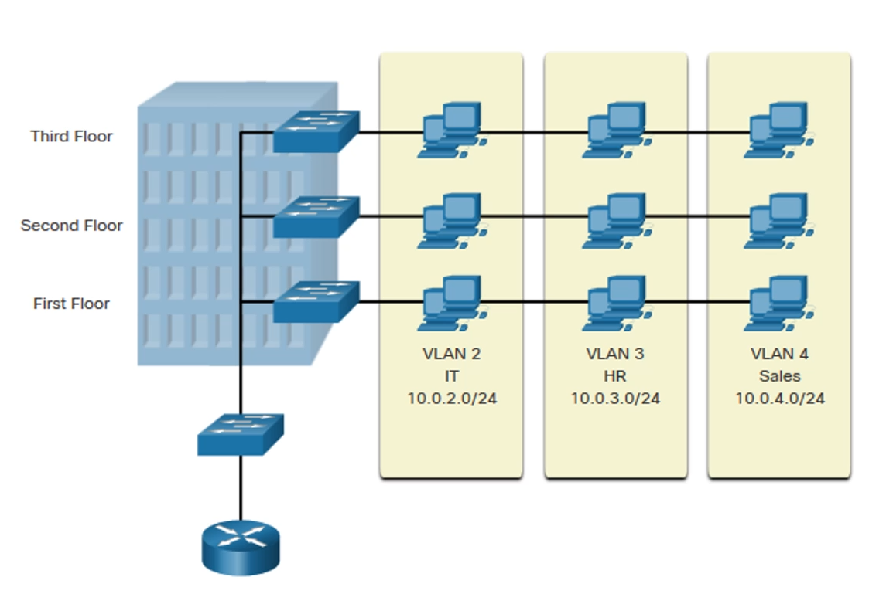

VLAN создаёт отдельную логическую сеть, разделяя интерфейсы коммутатора на разные сегменты сети, которые эмулируют работу локальной сети. Т.к все действия происходят в пределах одного коммутатора, то такие сети считаются виртуальными локальными сетями
  
Ограничивает широковещательный домен
  

Один порт коммутатора одна VLAN
  
Разделение на отдельные IP сети не спасает от широковещательной рассылки

## Настройка VLAN на коммутаторе

Прежде чем работать с VLAN, их необходимо создать. По умолчанию, создаются VLAN 1, VLANы, использующиеся для определенных типов сетей, которые уже устарели. Работать с VLANами по умолчанию **не желательно**

  
**Создавать VLAN будем на коммутаторах(L2 или L3)**, т.к VLAN относится к понятиям локальной, коммутируемой среды

#### Создание VLAN:
```
S(config)# vlan vlan_id // vlan_id - это номер VLAN
S(config-vlan)# name vlan_name // vlan_name - даём имя, чтобы при просмотре конфигурации его было проще отследить 
S(config-vlan)# exit
```
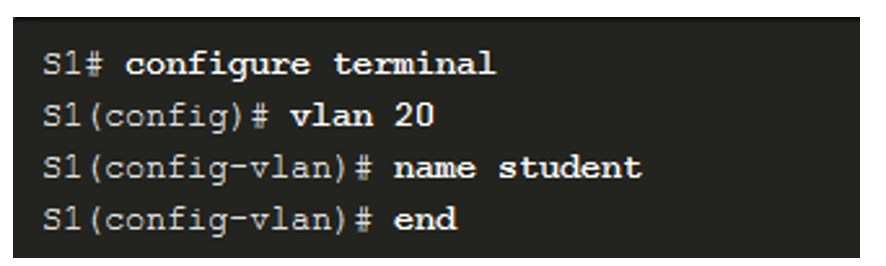

### Просмотр созданных VLAN
команда покажет все созданные VLAN, а также как распределены порты по VLAN
```
S# show vlan brief
```

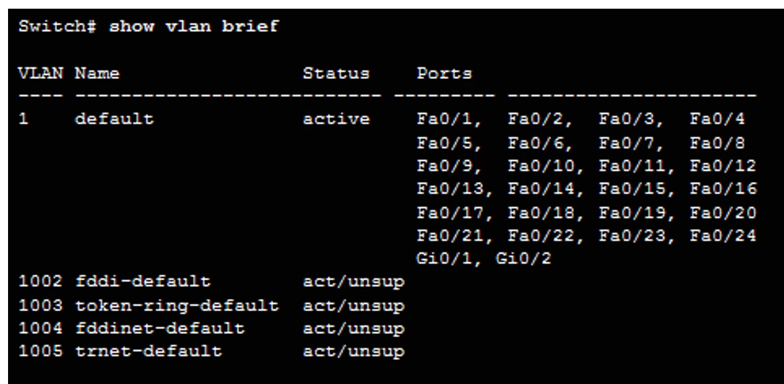


Покажет кол-во созданных VLAN, в том числе расширенных VLAN
```
S1# show vlan summary
```
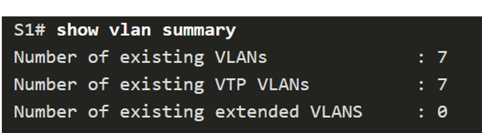

Покажет настройки конкретной VLAN
```
S1# show vlan name vlan_name
```
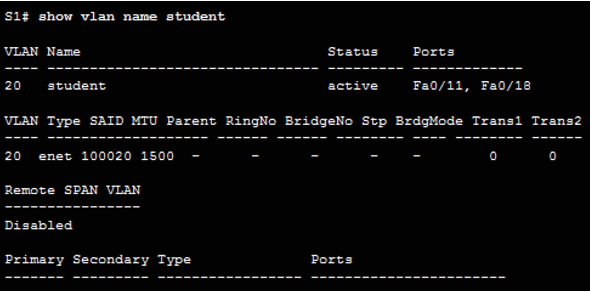

Показывает режим настройки интерфейса, также можно посмотреть в каких vlan находится интерфейс(см рыжий текст)

```
S1# show interfaces interface_name switchport 
```
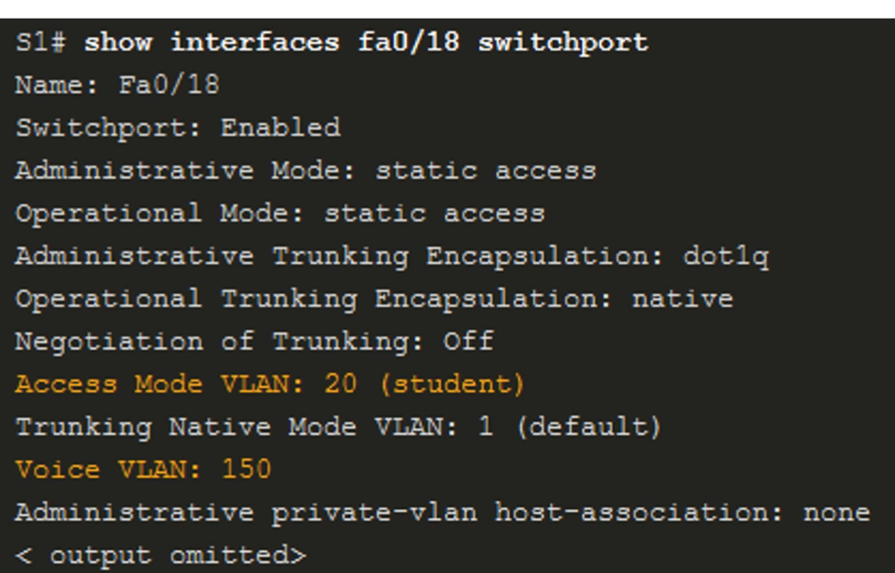

*Само по себе создание VLAN ещё не даёт нам полноценной работы VLAN с разделением портов по разным VLAN.* ***Поэтому нужно помещать порты коммутатора в созданные нами VLAN***

### Добавление портов в VLAN

Схема сети для картинок с примерами

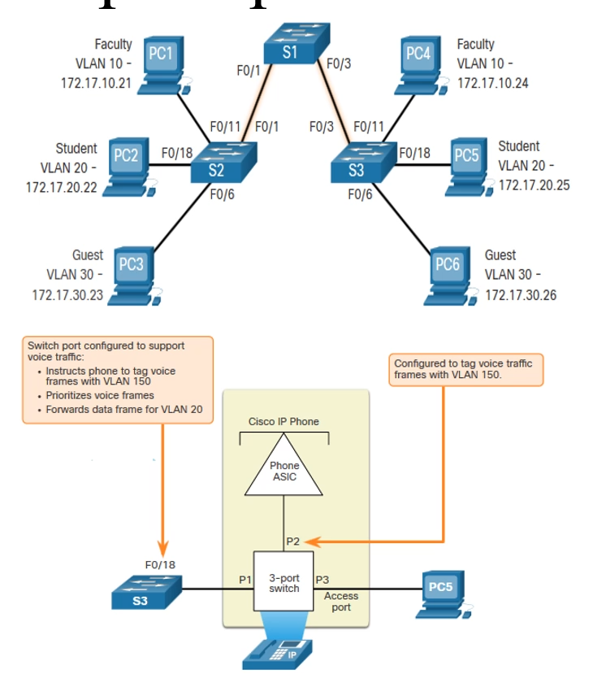

> S(config)# interface interface_id

> S(config-if)# switchport mode access // *включаем режим работы доступа на порте коммутатора, т.е порт ведет к клиентам и будет помещен в какую-то VLAN.*

> S(config-if)# switchport access vlan vlan_id // *Указываем куда помещаем порт, если не вводить эту строку, то порт по умолчанию помещается в VLAN 1*

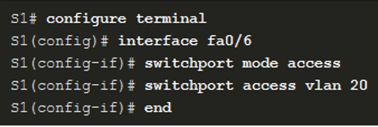

После такой настройки, интерфейс работает только в этом VLAN

  
Режим работы access не рекомендуется использовать для интерфейсов, ведущих к другому сетевому оборудованию(свитчам и роутерам). **Режим access подходит только для работы с клиентами !!!**

**Если к интерфейсу подключена IP телефония, то команда добавления порта в VLAN будет такой:**
> S(config-if)# switchport voice vlan vlan_id

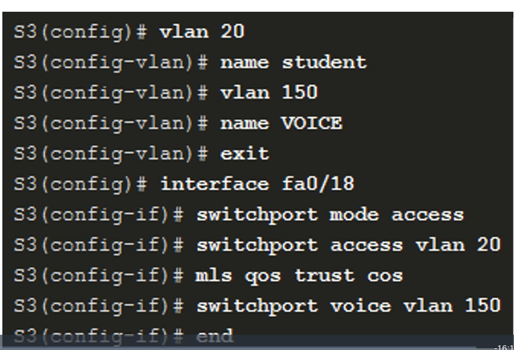

### Изменение принадлежности порта VLAN

Чтобы вернуть интерфейс в значение по умолчанию.
> S1(config-if)# no switchport access vlan

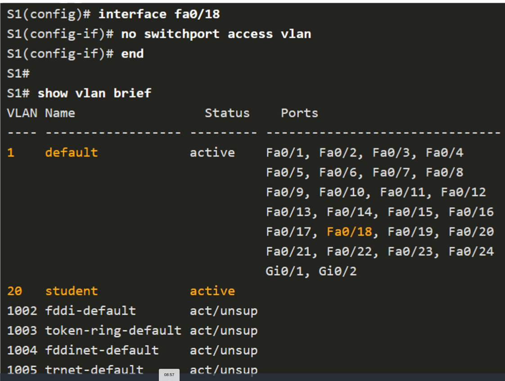

### Удаление VLAN

Прежде чем удалять VLAN, необходимо все интерфейсы, находящиеся в этой VLAN перенести в другой VLAN
  
Если сначала удалить VLAN,то интерфейсы, которые были в этой vlan станут неактивными.


**Удаление настроек с интерфейса**:

> S(config)# interface *interface_id*

> S(config-if) no switchport mode access

**Удаление сети VLAN:**
> S(config)# no vlan vlan_id

или

> S# delete flash:vlan.dat 
> > Позволяет удалить все, кроме тех что по умолчанию, vlanы, т.к удаляем файл с конфигурацией vlanов


### Настройка Trunk порта
позволяют передавать и получать трафик для vlan, настроенных на разных коммутаторах

> S(config)# interface *interface_id*

> S(config-if)# switchport mode trunk
> > указали, что интерфейс работает в режиме trunk порта

> S(config-if)# switchport trunk encapsulation dot1q
> > указываем инкапсуляцию, в которой будет работать порт. Это тот самый протокол, который добавляет доп заголовок с тегом в заголовок кадра ethernet

> S(config-if)# switchport trunk native vlan vlan_id
> > указываем номер vlan, который будет использоваться в качестве native vlan. По умолчанию native vlan это первая vlan

> S(config-if)# switchport trunk allowed vlan vlan_list
> > задаём список номеров VLAN, которые могут осуществлять передачу трафика по настраевому интерфейсу.По умолчанию на транковом интерфейсе разрешен весь трафик

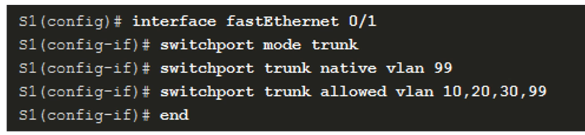

### Проверка транковых портов

> S# show interfaces interface_id switchport

> > 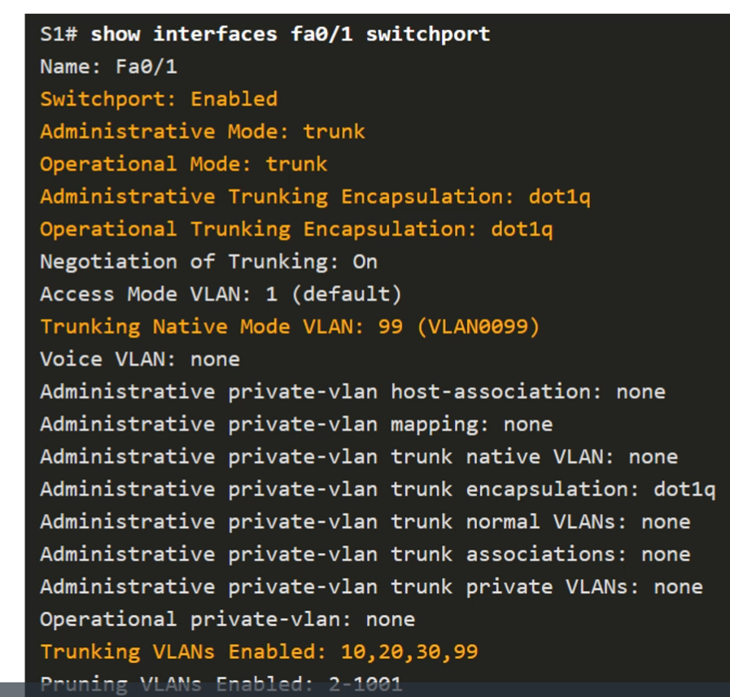

> > можем вывести все настройки конкретного VLAN 

> > То что мы настроили конкретный режим на интерфейсе, ещё не означает, что интерфейс будет в нем работать. Поэтому важно обращать внимание на Operational mode, который показывает фактический режим работы порта.  

> > Т .к транковые порты ведут к другому сетевому оборудованию, то необходимо чтобы на одном канале связи с двух сторон были одинаковые настройки транкового порта.


> > Если настройка транковых портов будет отличаться, то транк не сойдётся, поэтому порт не сможет работать в режиме транка, т.е трафика может вообще не быть, либо он будет передваться с перебоями

> **S# show interfaces trunk**

> > позволяет просматривать настройки транков()

> > 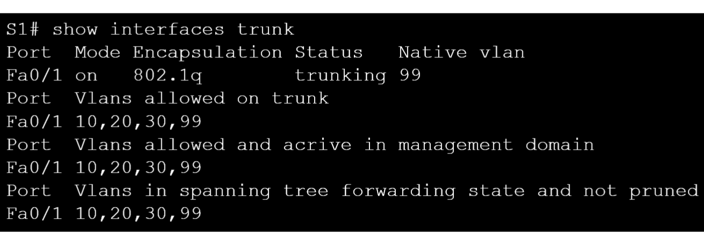