# Настройка VLAN
## Краткое воспоминание о VLAN


VLAN создаёт отдельную логическую сеть, разделяя интерфейсы коммутатора на разные сегменты сети, которые эмулируют работу локальной сети. Т.к все действия происходят в пределах одного коммутатора, то такие сети считаются виртуальными локальными сетями
  
Ограничивает широковещательный домен
  

Один порт коммутатора одна VLAN
  
Разделение на отдельные IP сети не спасает от широковещательной рассылки

## Настройка VLAN на коммутаторе

Прежде чем работать с VLAN, их необходимо создать. По умолчанию, создаются VLAN 1, VLANы, использующиеся для определенных типов сетей, которые уже устарели. Работать с VLANами по умолчанию **не желательно**

  
**Создавать VLAN будем на коммутаторах(L2 или L3)**, т.к VLAN относится к понятиям локальной, коммутируемой среды

#### Создание VLAN:
```
S(config)# vlan vlan_id // vlan_id - это номер VLAN
S(config-vlan)# name vlan_name // vlan_name - даём имя, чтобы при просмотре конфигурации его было проще отследить 
S(config-vlan)# exit
```


### Просмотр созданных VLAN
команда покажет все созданные VLAN, а также как распределены порты по VLAN
```
S# show vlan brief
```


Покажет кол-во созданных VLAN, в том числе расширенных VLAN
```
S1# show vlan summary
```


Покажет настройки конкретной VLAN
```
S1# show vlan name vlan_name
```


Показывает режим настройки интерфейса, также можно посмотреть в каких vlan находится интерфейс(см рыжий текст)

```
S1# show interfaces interface_name switchport 
```


*Само по себе создание VLAN ещё не даёт нам полноценной работы VLAN с разделением портов по разным VLAN.* ***Поэтому нужно помещать порты коммутатора в созданные нами VLAN***

### Добавление портов в VLAN

Схема сети для картинок с примерами


> S(config)# interface interface_id

> S(config-if)# switchport mode access // *включаем режим работы доступа на порте коммутатора, т.е порт ведет к клиентам и будет помещен в какую-то VLAN.*

> S(config-if)# switchport access vlan vlan_id // *Указываем куда помещаем порт, если не вводить эту строку, то порт по умолчанию помещается в VLAN 1*


После такой настройки, интерфейс работает только в этом VLAN

  
Режим работы access не рекомендуется использовать для интерфейсов, ведущих к другому сетевому оборудованию(свитчам и роутерам). **Режим access подходит только для работы с клиентами !!!**

**Если к интерфейсу подключена IP телефония, то команда добавления порта в VLAN будет такой:**
> S(config-if)# switchport voice vlan vlan_id


### Изменение принадлежности порта VLAN

Чтобы вернуть интерфейс в значение по умолчанию.
> S1(config-if)# no switchport access vlan


### Удаление VLAN

Прежде чем удалять VLAN, необходимо все интерфейсы, находящиеся в этой VLAN перенести в другой VLAN
  
Если сначала удалить VLAN,то интерфейсы, которые были в этой vlan станут неактивными.


**Удаление настроек с интерфейса**:

> S(config)# interface *interface_id*

> S(config-if) no switchport mode access

**Удаление сети VLAN:**
> S(config)# no vlan vlan_id

или

> S# delete flash:vlan.dat 
> > Позволяет удалить все, кроме тех что по умолчанию, vlanы, т.к удаляем файл с конфигурацией vlanов


### Настройка Trunk порта
позволяют передавать и получать трафик для vlan, настроенных на разных коммутаторах

> S(config)# interface *interface_id*

> S(config-if)# switchport mode trunk
> > указали, что интерфейс работает в режиме trunk порта

> S(config-if)# switchport trunk encapsulation dot1q
> > указываем инкапсуляцию, в которой будет работать порт. Это тот самый протокол, который добавляет доп заголовок с тегом в заголовок кадра ethernet

> S(config-if)# switchport trunk native vlan vlan_id
> > указываем номер vlan, который будет использоваться в качестве native vlan. По умолчанию native vlan это первая vlan

> S(config-if)# switchport trunk allowed vlan vlan_list
> > задаём список номеров VLAN, которые могут осуществлять передачу трафика по настраевому интерфейсу.По умолчанию на транковом интерфейсе разрешен весь трафик


### Проверка транковых портов

> S# show interfaces interface_id switchport

> > 

> > можем вывести все настройки конкретного VLAN 

> > То что мы настроили конкретный режим на интерфейсе, ещё не означает, что интерфейс будет в нем работать. Поэтому важно обращать внимание на Operational mode, который показывает фактический режим работы порта.  

> > Т .к транковые порты ведут к другому сетевому оборудованию, то необходимо чтобы на одном канале связи с двух сторон были одинаковые настройки транкового порта.


> > Если настройка транковых портов будет отличаться, то транк не сойдётся, поэтому порт не сможет работать в режиме транка, т.е трафика может вообще не быть, либо он будет передваться с перебоями

> **S# show interfaces trunk**

> > позволяет просматривать настройки транков(какие порты относятся к транковым портам, какие vlan разрешены в транковых портах)

> > 

### Сброс настроек транка(порт остаётся транковым)
Если нам перестал быть нужен транковый порт, то мы можем вернуть все настройки по умолчанию

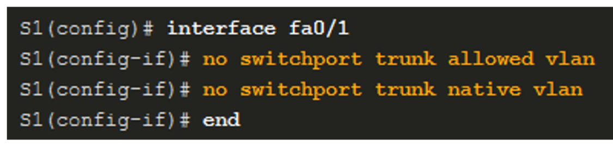

После сброса настроек делаем проверку и видим, что что интерфейс работает в 1 VLAN, а также интерфейс принимает трафик со всех vlan(значение по умолчанию) 

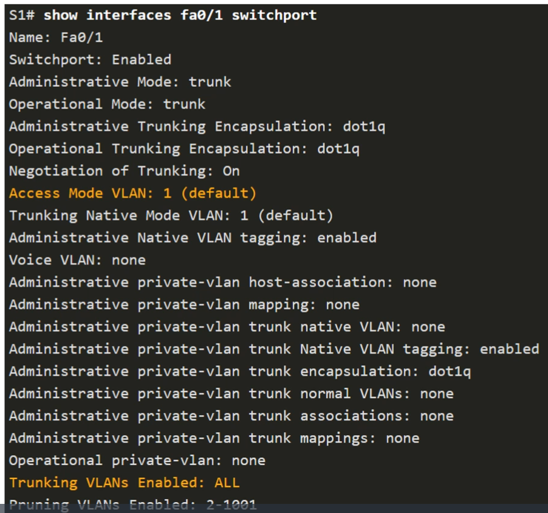

### Полный сброс настроек интерфейса(интерфейс перестаёт быть транковым)

Помещаем интерфейс в режим доступа(снимаем с него статус Trunk)
  

режим поменялся на static access

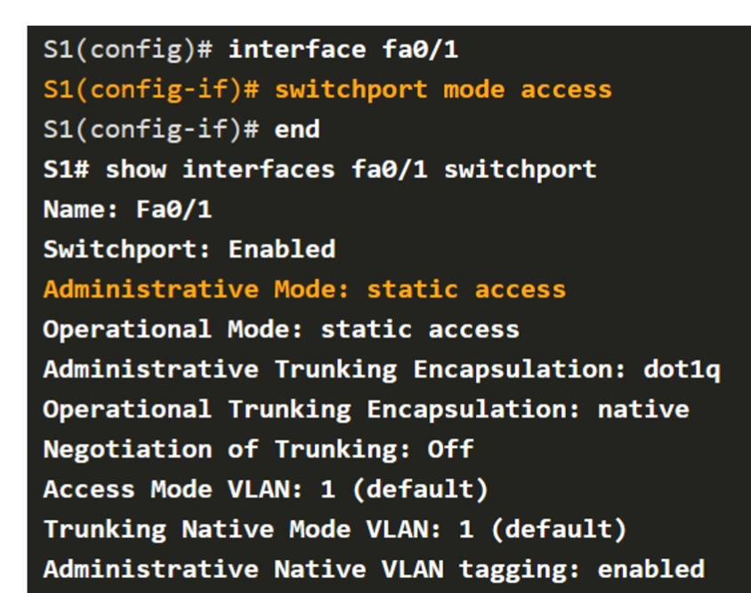

# Маршрутизация между VLAN

VLAN - это виртуальные локальные сети. Им требуется 3 маршрутизирующее устройство, которое будет объединять сети между собой


***Cуществует 3 подхода маршрутизации VLAN:***

* *Старый:* **1 порт - 1 VLAN**
  * 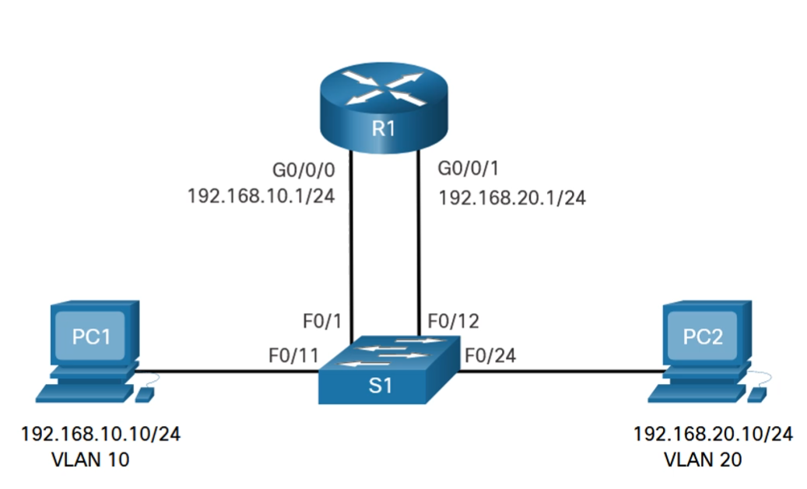

  * Есть выделенный маршрутизатор для маршрутизации между разными VLAN, в котором отдельный интерфейс маршрутизатора принадлежит отдельной VLAN. Т.е мы к отдельному интерфейсу маршрутизатора относимся как к отдельному клиенту сети, подключенному к VLAN. Выделенный интерфейс маршрутизатора является полноценным участником VLAN.
   
  * Огромный минус, этого подхода в том, что у маршрутизатор должно быть столько интерфейсов, сколько у есть VLAN, т.к портов не напасешься, плюс накладные расходы.
  
  * просто и легко настраивается
  
* **Router-on-a-Stick** *более современный*
  * 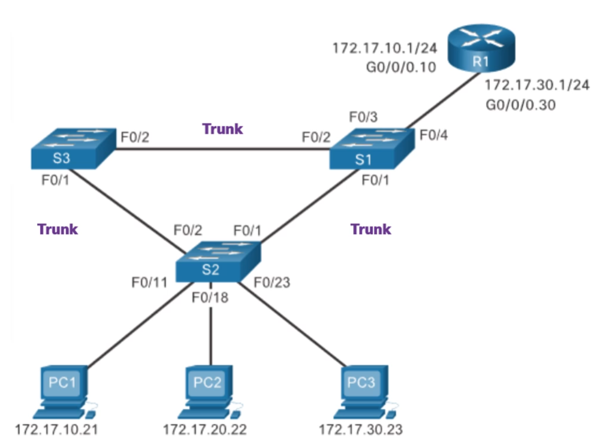
  * Есть выделенный маршрутизатор, который объединяет VLAN, но объединение происходит через один выделенный интерфейс маршрутизатора, настроенный специальным образом.
  * То, что нужно использовать всего один интерфейс является большим преймуществом.
  * Настройка усложнилась, нужно более четкое понимание
  * Есть ограничение по кол-ву VLAN, которые могут работать внутри одного VLAN. **Их должно быть не более 50**

* **Коммутация 3его уровня с использованием интерфейса SVI** *предпочтителен при построении больших сетей, проектировании иерархической структуры сети*
  * 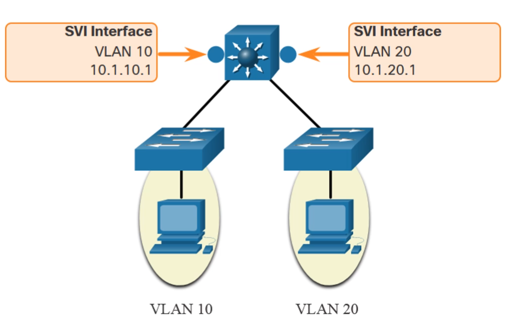
  * Маршрутизируемым устройством является L3 коммутатор. Коммутатор L3 будет гораздно эффективнее работать с маршрутизацией между VLAN. 
  * Сама маршрутизация осуществляется через интерфейс SVI
  * Требуется специальная настройка и понимание процесса настройки
  * Высокая цена на L3 коммутаторы
  * L3 коммутатор более предпочтительное устройство за счет одновременной поддержки коммутации и маршрутизации в больших сетях

## Настройка старого метода работы (1 порт - 1 VLAN)

**Настройка коммутатора**
Создаём vlan
> S(config) # vlan *vlan_id*

> S(config-vlan) # name *vlan_name*


помещаем порт коммутатора в vlan с vlan_id
> S(config)# interface interface_id

> S(config-if)# switchport mode access

> S(config-if)# switchport access vlan vlan_id

**Настройка маршрутизатора**

нужно только настроить интерфейс, присвоив ему ip адрес. 

> R(config)# interface *interface_id*

> R(config-if)# ip address *ip_address* *subnet_mask*

> R(config-if)# no shutdown

## Настройка по методу router-on-a-stick

**Настройка коммутатора:**

Создаём vlan
> S(config) # vlan *vlan_id*

> S(config-vlan) # name *vlan_name*


помещаем порт коммутатора в vlan с vlan_id

> S(config)# interface interface_id

> S(config-if)# switchport mode access

> S(config-if)# switchport access vlan vlan_id

выделенный интерфейс коммутатора, ведущий к роутеру, настраиваем в режиме Trunk.
  
на транковом интерфейсе необходимо создать native vlan, а также задать разрешенные vlan, см как это делать ранее

> S(config)# interface *interface_id*

> S(config-ig)# switchport mode trunk

**Настройка маршрутизатора:**
Настраиваем интерфейс роутера, который связан с транковым портом коммутатора. На этом интерфейсе для каждого VLAN создаём подинтерфейсы (виртуальные интерфейсы на базе одного физического интерфейса)

> R(config)# interface *interface_id.subinterface_id*
> > Разбиваем физический интерфейс на виртуальные подинтерфейсы
> > Сам физический интерфейс мы не настраиваем, но **нужно его включить**
> > Номер подинтерфейса совпадает с номером VLAN, для которой он был создан, для удобности восприятия

После переходим в режим config-subif - режим настройки подинтерфейса

> R(config-subif)# encapsulation dot1q *vlan_id*
> > Указываем режим инкапсуляции, а также номер vlan, к которой относится настраиваемый подинтерфейс

> R(config-subif)# ip addpress *ip_address* *subnet_mask*
> > настраиваем адрес сети, адрес ip адрес интерфейса, который будет шлюзом для этой сети

**Пример** 

Пример настройки интерфейса у маршрутизатора. Коммутатор смотри ранее

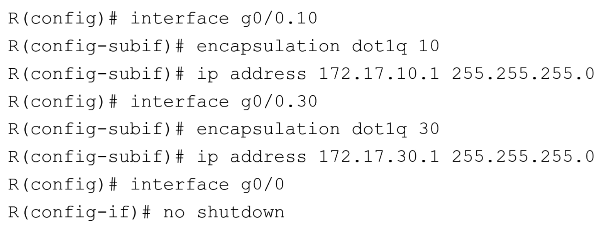
Пример с более сложной сетью. 2 коммутатора связаны друг с другом и 1 маршрутизатор, необходимый для работы между VLAN.
  
Связь между коммутаторами находится в транке
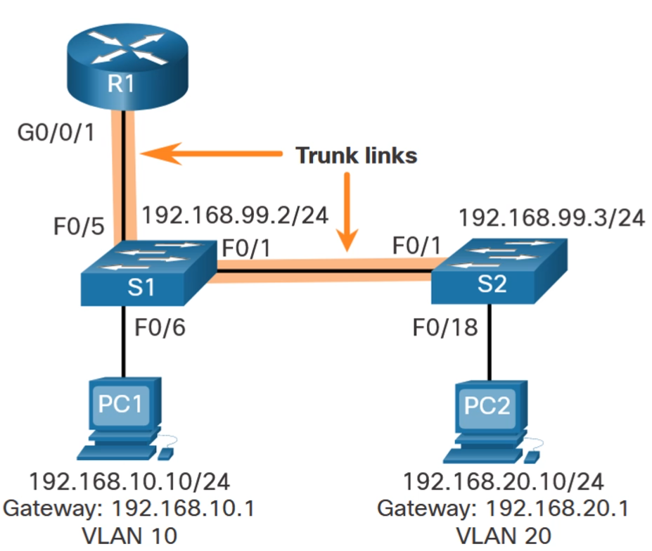

Команды, которые настраивают коммутатор S2 в этой сетке

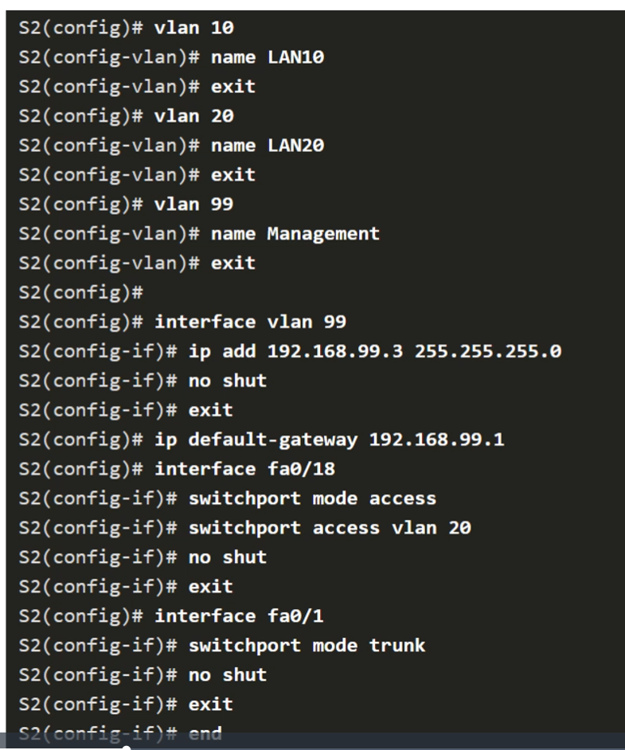

Команды, которые настраивают роутер в этой сетке

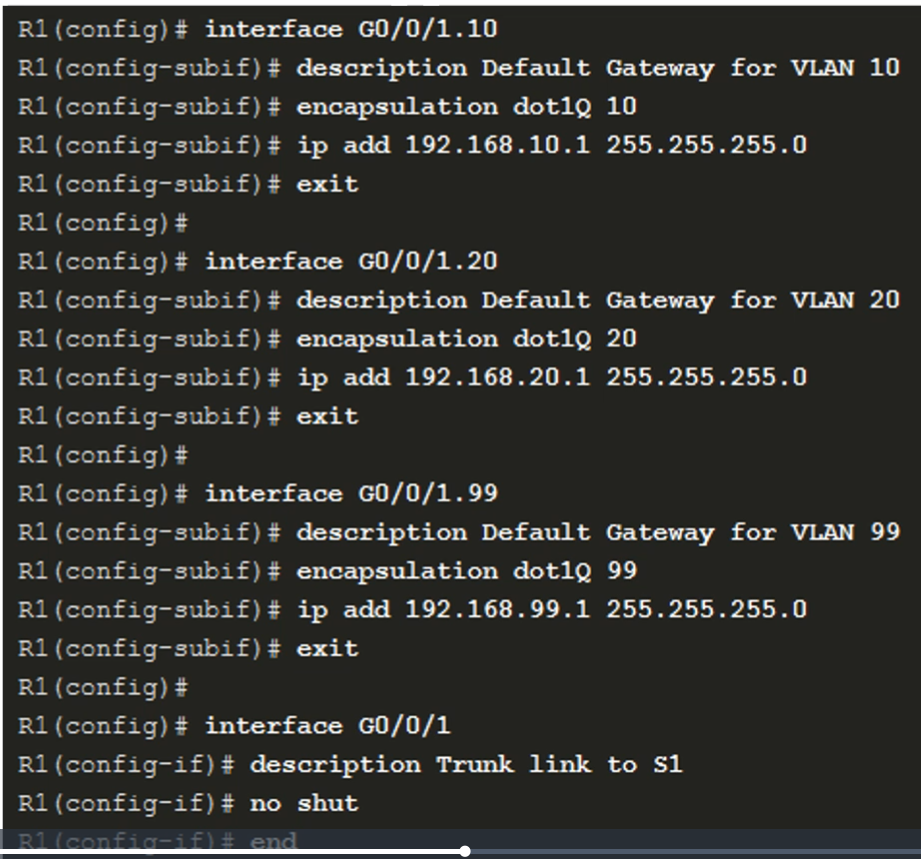

### Проверка подинтерфейсов(проверяем, что они созданы, а также настроены с нужными адресами)

> show ip route


> show ip interface brief

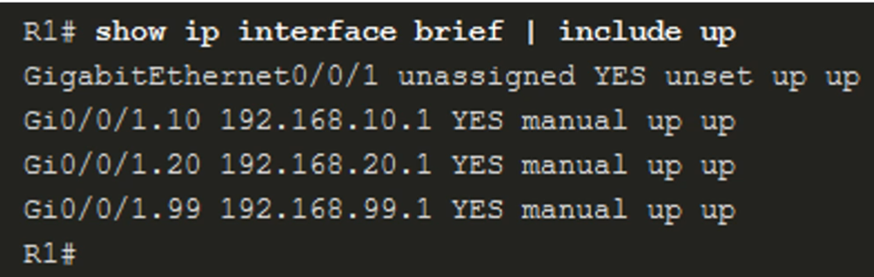

> show interfaces *interface_name.subinterface_name*
> > покажет состояние конкретного подинтерфейса

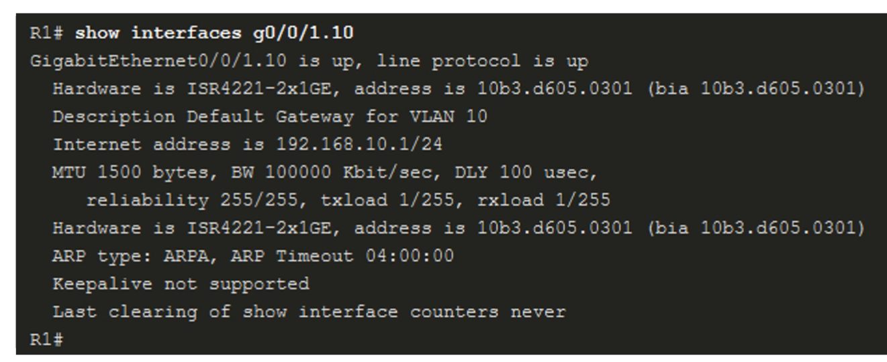

> show interfaces trunk
> > проверяем настройку транковых портов на коммутаторе

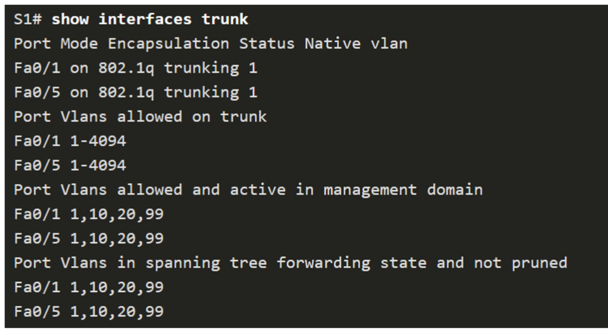

## Настройка L3 коммутатора

Пропускаем настройку L2 коммутатора, т.к её уже рассматривали ранее

**Создание VLAN:**
> S(config) # vlan *vlan_id*

> S(config-vlan) # name *vlan_name*

**Настройка интерфейса SVI:**
> S(config) #interface *vlan_id*

> S(config-if)#ip address *ip_address subnet_mask*

**Включение маршрутизации**
> S(config)# ip routing
> > нужно включить, т.к по умолчанию она отключена

**Примеры**

Пример сетки с L3 коммутатором

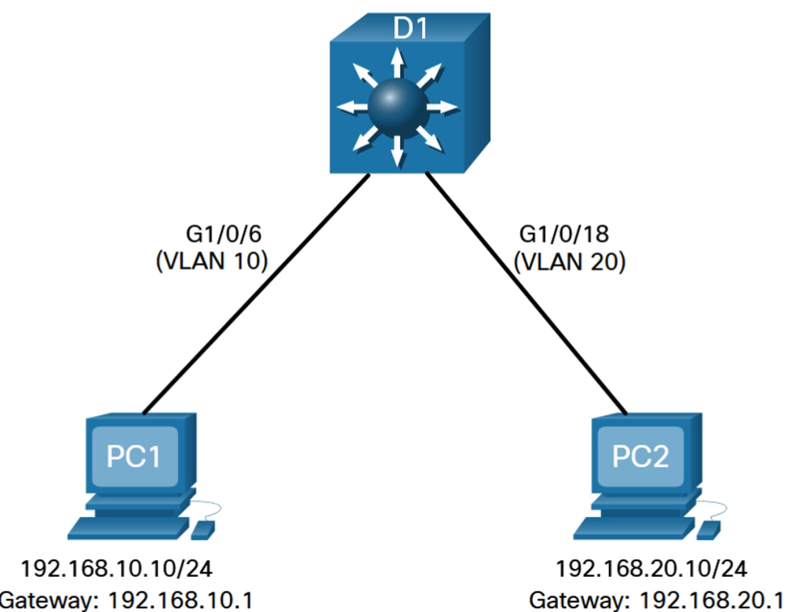

Вот как выглядит настройка виртуальных интерфейсов на L3 коммутаторе

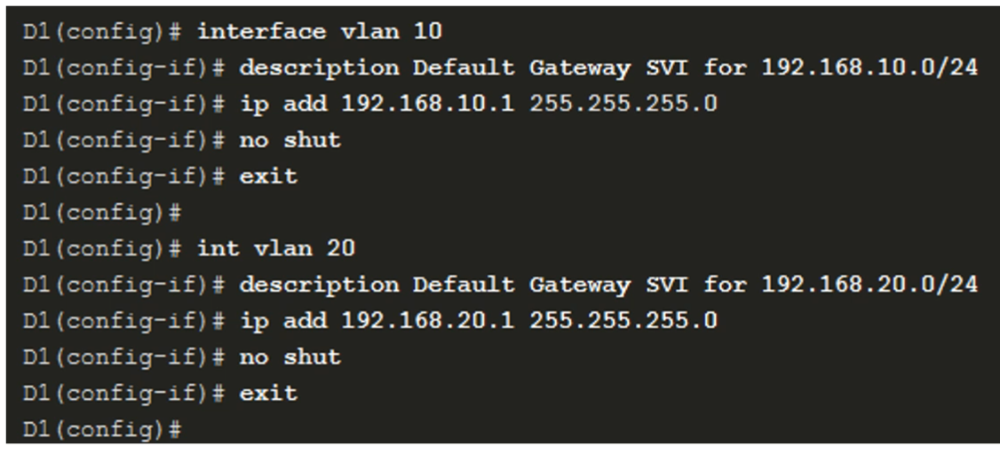

Настраиваем физические интерфейсы на всё том же L3 коммутаторе. Включаем маршрутизацию

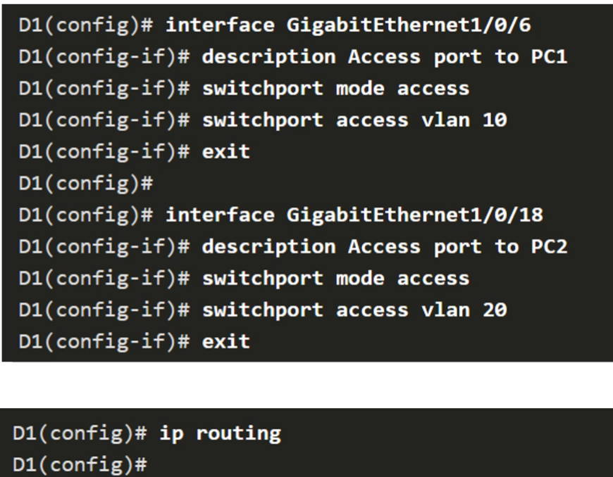

Можно подключать коммутатор L3 к другим L3 устройствам, с помощью настройки портов L3
  
До этого мы подключали клиентов через коммутируемые порты, т.е клиенты подключаются к коммутатору. На самих физических сетях никаких ip адресов не настраивали, т.к настроить ip адрес на коммутаторе нельзя.

У L3 коммутатора есть виртуальные интерфесы, которые уже могут быть настроены как интерфейсы L3.
  
Если мы хотим организовать соединение между L3 коммутатором и другим устройством L3, то необходимо иметь физический интерфейс 3его уровня. LL 3 коммутатор такие интерфейсы как раз имеет, можно переключить их с режима коммутации в режим маршрутизации.

Будем рассматривать пример настройки интерфейса LL3 коммутатора D1 G0/0/1, ведущего в роутер R1. 

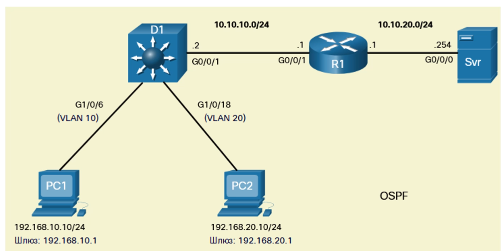

Программа настройки LL3 коммутатора

> no switchport
> > команда позволяет выйти из режима коммутации, т.е порт будет маршрутизируемым, а затем задём ip адрес

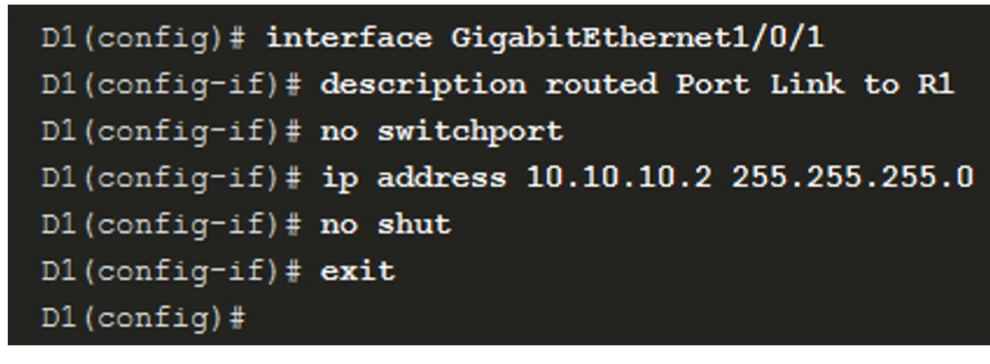

## Troubleshooting

Процесс настройки VLAN сложный, рассмотрим типичные ошибки

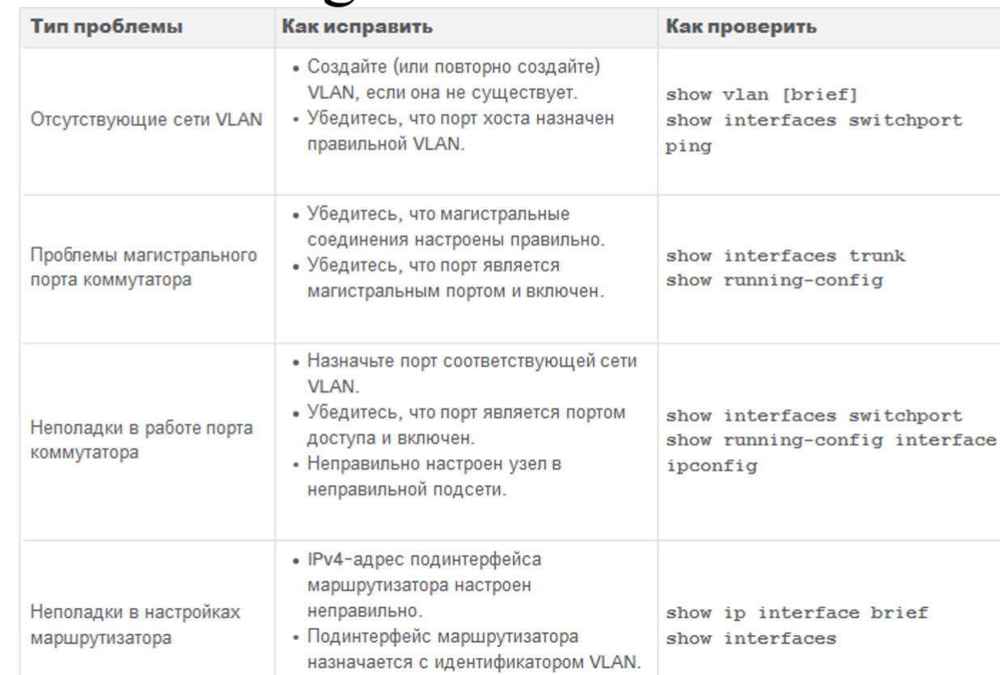

**Пример**

1. Смотрим создались ли нужные vlan на свитчах s1 и s2
2. Cмотрим настроены ли интерфейсы для связи с клиентами в режим доступа с нужными vlan
3. Внимательно следи за транковыми портами, настройка транковых портов на противоположных концах должна быть одинаковой(те же allowed vlan, та же native vlan и тд)
4. В маршрутизаторе R1 следим, чтобы интерфейс g0/0/1 был разлелен на соответствующие подинтерфейсы и на них была настроена инкапсуляция
5. Нужные интерфесы vlan имеют нужные ip адреса
6. Нужно посмотреть, что ip адреса на компах принадлежат своим сетями 
7. 

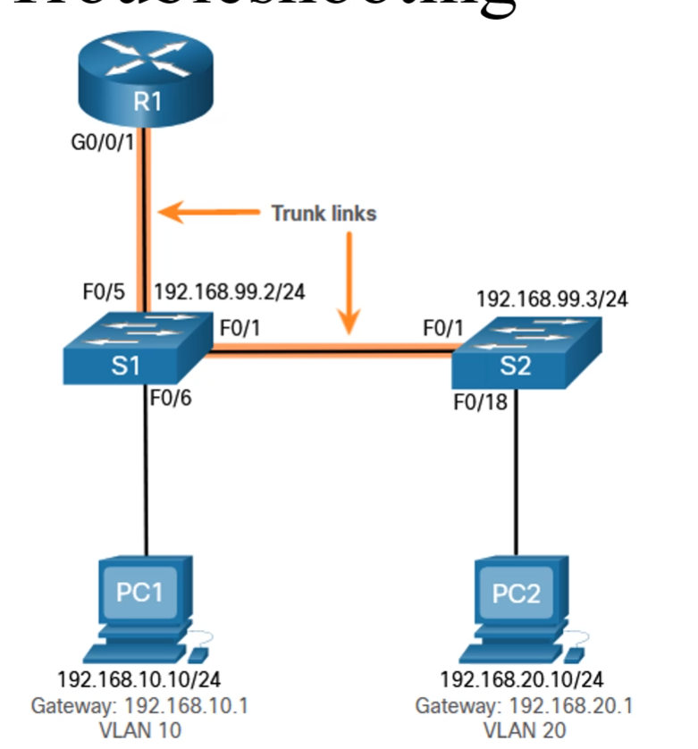