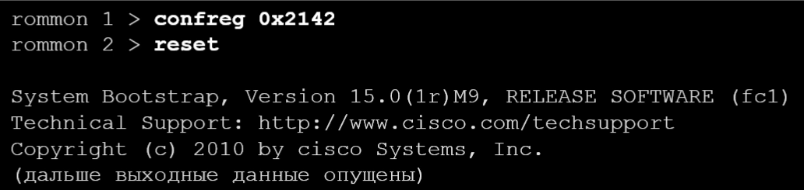

# Обслуживание устройств
## Устройство Свитчей и Роутеров
### Вычислительная машина

Все сетевые устройства это компьютеры с вполне определенной функцией

Роутерам и свитчам необходимы следующие компоненты:
1. Центральный процессор(ЦП)
2. Операционная система(ОС)
3. 
   1. Энергозависимая:
      1. Оперативное запоминающее устройство(ОЗУ), 
   2. Энергонезависимая: 
      1. постоянное запоминающее устройство(ПЗУ) 
      2. энергонезависимое запоминающее устройство(NVRAM) 
      3. флеш память

## Память устройств


## Процесс загрузки

 

Процесс загрузки коммутаторов и роутеров идентичен, поэтому он будет рассматриваться в общем случае.

* Сразу после включения устройство загружает программу самотестрирования питания POST(Программа тестирует ЦП, процессор, оперативную динамическую память (DRAM) и часть флеш устройств, составляющих файловую систему флеш-памяти)
* Затем идет запуск ПО начального загрузчика. Начального загрузчик хранится в пзу и запускается сразу после успешного завершения первого этапа 
  * Начальный загрузчик выполняет низкоуровневую инициализацию ЦП. Он инициализирует регистры цп, которые контролируют место отображения физической памяти, кол-во памяти и её скорость
* Запуск файловой системы флеш-памяти на материнской плате
* Загрузка ОС IOS, передача управления коммутатором ОС 


* IOS выполняет автоматическую загрузку из переменной BOOT или,если в boot не задан путь к исполняемому файлу, то загружается первый исоплняемый файл, который хранится в флеш-памяти
* Затем IOS инициализирует все интерфейсы, используя команды Cisco IOS из файла загрузочной конфигурации, который хранится в энергозависимой ОЗУ(NVRAM) из того самого файла startup-config (для свитчей название config.text), находящегося в флеш-памяти
* Команда ```show boot``` показывает, как настроен файл текущей загрузки IOS.
* Команда ```boot system``` позволяет указать путь до исполняемого образа ОС
* **Важно прописывать конкретный путь до образа, чтобы иметь контроль за тем, какая ос будет использоваться на маршрутизаторе**

## Светодиодные индикаторы свитчей


* **Mode** используется для переключения состояния порта, дуплексного режима порта, скорости порта и, если поддерживается, состояния [Power over Ethernet (PoE)](https://habr.com/ru/companies/zyxel/articles/485842/) светодиодов порта
  * Нажимая кнопку mode можно перемещаться по представленным индикаторам и строить предположения о том, как функционирует коммутатор в данный момент.
* **SYST** показывает, есть ли питание системы и функционирует ли она должным образом. 
  * Если светодиод выключен, то система не включена,
  * Если горит зеленым, то всё работает нормально,
  * Если горит желтым, то при работе коммутатора возникают ошибки  
* **RPS** показывает статус резервного источника питания
  * Если не горит, то резервное питание отключено либо подключено неправильно
  * Если горит зеленым, то с резеврным источником питания всё норм
  * Если горит желтым, то резервное питание неисправно или находится в режиме ожидания
  * Если минает желтым, то произошел сбой внутреннего питания
* **STAT** указывает режим статуса порта. Данный режим является режимом по умолчанию 
  * нужно смотреть на индикатор над портами.
* **DUPLX** указывает на режим дуплексного порта 
  * (октл полудуплекс, вкл дуплекс)
* **SPEED** указывает выбранный режим скорости порта
* **PoE** указывает на состояние PoE на портах


## Светодиодные индикаторы маршрутизатора
 

# Поддержка файловой системы маршрутизаторов и коммутаторов
работа с файловой системой маршрутизатора и коммутатора практически не отличается.

* Можно перемещаться по разным папкам
* Смотреть список вложенных файлов и папок
* Перемещать, удалять, копировать файлы и папки

* команда ```show file systems``` покажет все доступные файловые системы на маршрутизаторе.
  * колонка flags показывает разрешения, которые есть у маршрутизатора для работы с этой файловой системой.
  * ro/wo - read/write only
  * rw - read and write

* Есть строка, которая выделена звездочкой, это означает что эта файловая система используется по умолчанию, т.е там хранятся все файлы, с которыми будет работать наш маршрутизатор (ОС, файл конфигурации)
* Эта же строка помечена решеткой, что значит, что загрузочная информация находится в этой файловой системе


* Чтобы посмотреть содержимое файловой системы нужно ввести команду ```dir```
* Последний файл это и есть образ ОС, который загружает роутер


* Можно перемещаться между файловыми системами с помощью команды ```cd имя_файловой_системы:```
* Команда ```pwd``` возращает путь до текущей файловой системы
* Тут самый важный файл это startup-config


## Файловая система коммутатора
* Команда ```show file systems``` покажет доступные файловые системы
* Звездочка указывает на файловую систему по умолчанию
* команды ```cd``` и ```pwd``` работают аналогично


## Резервное копирование
локальное хранение не является надежным, т.к в случае поломки устройства(достаточно поломки флеш-карты) теряется доступ к файлам. 
  
Поэтому важно иметь резервные копии файла конфигурации, образа.

Способ резервного копирования не зависит от устройства. Для маршрутизаторов и коммутаторов это будет выполняться одинаково

1. Самый простой способ это удаленно подключиться к устройству(Telnet ssh), вывести конфигурацию с помощью команды ```show running-config```, скопировать текст конфигурации, а затем сохранить его в файле на локальном компьютере. Чтобы восстановить конфигурацию достаточно сделать копипаст конфигурации с локального компа на устройство
   1. Необходимо удалить лишние символы, которые выводятся при отображении конфигурации
   2. Самый простой способ резервного копирования

2. Можно коппировать файл конфигурации с помощью команды ```copy running-config tftp``` 
   1. таким способом можно скопировать любой другой файл, сохранненый на устройстве
   2. [tftp](https://ru.wikipedia.org/wiki/Trivial_File_Transfer_Protocol) - протокол, используемый для передачи данных
   3. После ввода команды устройство спросит у нас адрес удаленного сервера, на который мы хотим сохранить указанный файл
      1. Перед этим необходимо проверить, что сервер доступен
   4. После ввода ареса, устройство спросит, как назвать файл, в который сохранится конфигурация
   5. Затем после нажатия enter мы подтвердим копирование на удаленный сервер
   6. Если на удаленном устройстве сущетсвует файл с таким именем, то устройство выдаст предупреждение и спросит, нужно ли перезаписать указанный файл.(можем подтвердить перезапись либо переименовать файл)


3.  Можно создавать копии на usb носителях с помощью команды ```copy running-config usbflash0```
    1.  Вместо usbflash0 может быть другое имя usb интерфейса(чтобы посмотреть используй ```show file systems```)
    2.  после введения команды устройство спросит как назвать файл
    3.  После нажимаем enter и процесс копирования запущен !


**Перед тем как прописывать устройство назначения нужно посмотреть, как будет названа usb флешка в указанной файловой системе.**

Чтобы убедиться в успешном копировании файла можно использовать команду ```dir название_флешки``` и обнаружить в выводе скопированный файл

* С помощью команды ```more полное_название_файла``` можно посмотреть его содержимое


## Восстановление пароля

В зависимости от устройства подробная процедура востановления пароля варьируется, но все они основаны на одном и том же принципе.

**Рассмотрим процедуру восстановления пароля на примере роутера**

1. Войдите в режим ROMMON
2. Измените значение регистра конфигурации
3. Скопируйте startup-config в running-config
4. Измените пароль
5. Сохраните running-config как новый startup-config
6. Перезагрузите устройство
   
### ШАГ 1 войдите в режим ROMMON
ROMMON - это режим начального загрузчика, на этом этапе не загружена ОС и конфигурация

Чтобы туда попасть понадобится консольный доступ к устройству

Используя специальную комбинацию клавиш (ctrl + break в PuTTY) вводим прерывание во время процесса загрузки. **Лучше использовать прерывание**
  
  ИЛИ

Включить устройство предвартельно, Вынув из него внешнюю флеш-память, когда устройство отключено. Т.к устройству не откуда будет считать ОС, то устройство автоматически перейдет в режим загрузчика


После перехода в режим загрузчика терминал будет выглядеть следующим образом


### ШАГ 2 Измените значение регистра конфигурации

* По умолчанию для работы маршрутизатора используется регистр 0x2102. Обычная загрузка маршрутизатора с использованием всех загрузочных файлов.

Установить регистр конфигурации 0x2142, для игнорирования загрузочной конфигурации
* Регистр 0x2142 скажет устройству игнорировать загрузочную конфигурацию, т.е файл startup-config будет проигнорирован при загрузке маршрутизатора. 

Ввести reset в командной строке, чтобы перезапустить устройство



### ШАГ 3 Копирование startup-config в running-config

После загрузки мы перешли в нормальный режим работы маршрутизатора, но с пустой конфигурацией. Мы же хотим использовать прошлую конфигурацию, поэтому её нужно скопировать.

Использовать команду copy startup-config running-config
* ```Copy откуда_копировать куда_копировать``` 


* Обходим пароль за счёт того, что автоматически перешли в привилигированный режим.
* После следует изменить пароль, сохранить его, а затем перезапустить устройство

* **НЕ ВВОДИТЬ copy running-config startup-config**, иначе мы потеряем конфигурацию
  
### ШАГ 4 Восстановление пароля

Т.к находимся в привилигированном режиме, то можем настраивать все необходимые пароли


### ШАГ 5 Сохранение running-config как новый startup-config
Изменить значение регистра конфигурации обратно на 0x2102 с помощью команды ```config-register 0x2102``` в режиме глобальной конфигурации
  
Сохранить running-config в startup-config


### Вся процедура восстановления пароля


## Восстановление пароля на коммутаторе

### Начальный загрузчик коммутатора

**У коммутаторов прерывание загрузки происходит по-другому, но всё равно необходимо иметь консольный доступ**

Доступ к начальному загрузчику
* Подключиться по консоли
* Отключить кабель питания
* Подключить кабель питания и в течение 15 секунд удерживать кнопку mode
* Подождать сигнал индикатора SYST: моргнет желтым, а затем загорится постоянный зеленый
* Увидеть запрос switch:
* Команда `set` показывает значение boot, команда `flash_init` инициализирует flash

Просмотр файлов во флеш-памяти коммутатора


На самом деле алгоритм такой же как и у маршрутизаторов, т.е заставить коммутатор загрузится с игнорированием загрузочной конфигурации, но махинация с регистрами тут не прокатит. Поэтому можно назвать загрузочный файл так, чтобы коммутатор не узнал в нем загрузочного файла, т.е просто переименовать найденный конфигурационный файл(**Запомни новое имя**), после чего коммутатор загрузится с чистого листа.

Дальше работаем также как и с роутером
* т.е помещаем startup-config в running-config
* поменять пароли
* сохранить новые данные 

# Управление образами IOS

## Services on Demand


Маршрутизатор поставляется с одной универсальной IP Base ОС - Cisco IOS, и для включения пакетов определенных наборов функций используется лицензия

IP Base представляет базовый функционал для конкретного устройства.
  
Для маршрутизаторов Cisco выпускаются 2 типа универсальных образов:
1. Универсальные образы, имя которых содержит "universalk9", содержат все функции Cisco IOS, в том числе мощные средства шифрования полезной нагрузки, такие как IPSec VPN, SSL VPN и Secure Unified Communications

2. Универсальные образы, имя которых содержит "universalk9_npe" - это шифровальные средства, представляемые системой активации Cisco(Cisco Software Activation), которые удовлетворяют экспортным ограничениям на криптографические средства

## Имена файлов образов IOS

Название IOS можно узнать, посмотрев содержимое флеш-памяти(смотри оранжевый текст)


**схема именования образа IOS**


mz - это наиболее распространненное обозначение для формата участка памяти и сжатия. Первая буква указывает, где маршрутизатор будет хранить образ во время работы 
  
**Возможные места хранения**:
* f - флеш-память
* m - ОЗУ
* r - ПЗУ
* 1 - переместимый

**Образ может быть сжат в формате**:
* z(zip) **Cамый распространненый**
* x(mzip)

## Резервное копирование образов IOS

Полезно сохранять образы ОС

Очень похоже на копирование файла конфигурации, правда образ ОС уже не получится скопипасть в файл на локальном компьютере
НО всё так же можно скопировать образ на выделенный сервер


Сначала проверяем доступность сервера с помощью команды `ping`


Чтобы посмотреть название образа на лакальном устройстве, используй команду `show имя_локального_устройства`


Чтобы скопировать образ на удаленный сервер используй команду `copy имя_файлвовой_системы: tftp`

Далее устройство запросит имя файла, которое хотим скопировать, поэтому придётся его переписать(на самом деле можно просто скопировать из вывода прошлых команд)

Далее указываем имя или адрес удаленного хоста


## Восстановление образов IOS
Обратным способом можно копировать IOS на само устройство. 


Проверяем связь с сервером, откуда хотим скачивать образ IOS


Проверяем, что на локальном носителе достаточно места(см рыжий текст)


Копируем IOS образ с удаленного tftp сервера на наше устройство
* Указываем адрес удаленного сервера

* Указываем источник копирования(нужно ввести имя образа)
* Указываем куда хотим скопировать файл(ничего не меняем, просто жми enter)
* 


## boot system

Скопировать образ ОС недостаточно
Устройству нужно сказать какой образ использвовать при следуйщей загрузке

* Меняем значение переменной boot, указывая в неё путь до того образа, с которого хотим загрузиться
* В переменную boot образы можно ввести по порядку для обеспечения отказоустойчивости
* При загрузке устройство ищет первый доступный файл образа ОС, если в переменной boot нет никаких значений
* После изменения переменной boot необходимо сохранить загрузочную конфигурацию `copy running-config startup-config`
* Затем перезагружаем устройство


Команда `show version` показывает версию ОС, запущенную на устройстве(см оранжевый текст)


