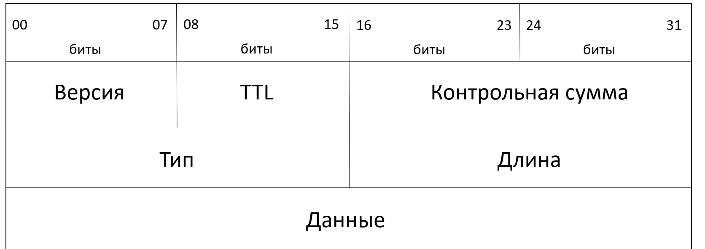
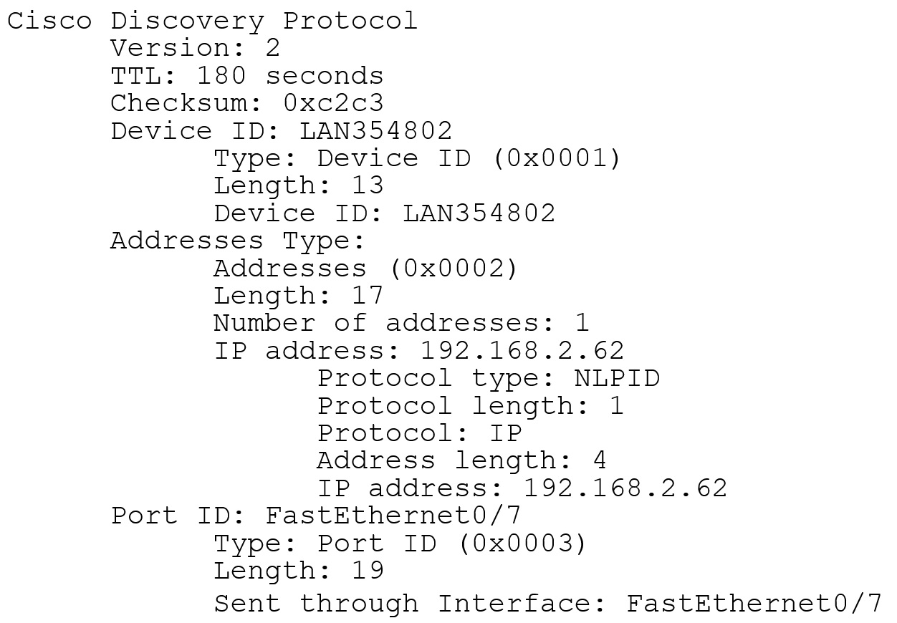
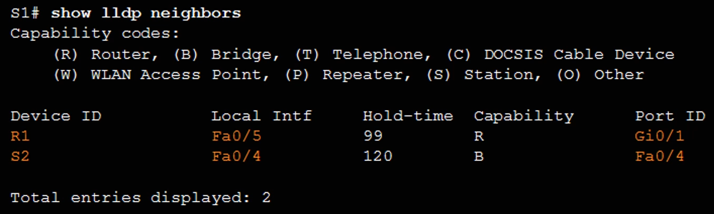

# Управление сетями и сетевым оборудованием
## Обнаружение устройств
Сейчас будут обсуждаться протоколы, которые помогают обнаруживать устройства в сети
### CDP (Cisco Discovery Protocol)

* Служит для сбора иноформации о cоседних устройствах, использующих один и тот же канал передачи данных
* Проприетарный Cisco протокол 2ого уровня(т.е работает на канальном уровне). Т.е этот протокол доступен только на оборудовании от Cisco
* Использует MAC-адрес **01-00-0с-сс-сс-сс** 
* Рассылка каждые 60 секунд в сетях Ethernet, Frame Relay, ATM
* Просмотр таблицы:
  * ```
    show cdp neighbors [detail]
    ```
    * Посмотреть подключенных соседей
  * ```
    show cdp entry {* | device-name [protocol | version]}
    ```
* Dead-timeout 180 секунд


2 подключенных устройства обмениваются сообщениями cdp, содержащими инфу об этих устройствах, каждые 60 секунд. Если устройство получило от соседнего устройства cdp сообщение, то это признак того, что "сосед" функционирует и канал связи остаётся рабочим. Если сообщение cdp не было получено в течении 180 секунд, то считается, что "сосед" вышел из строя, и устройство прекращает обмениваться с ним данными, пока заново не получит сообщение cdp.  
  
Протокол CDP работает не зависимо от других протоколов и не влияет на передачу трафика. CDP это просто административный протокол, который удобен для управления сетевым оборудованием  

#### Заголовок CDP


#### Данные, которые можно извлечь из CDP сообщения

* Идентификатор устройства. Это имя соседнего устройства, которое было задано маршрутизатором
* Номер и тип локального интерфейса, т.е того интерфейса, по которому данное устройство подключено к соседу
* Время удержания информации (время, по истечению которого записи из CDP-таблицы удаляются)
* Тип устройства(Роутер, свитч, сетевой мост и др)
* Физическая платформа устройства(модель подключенного устройства). Например можно узнать конкретную модель, серию и производителя маршрутизатора, а также получим инфу о типе и версии ОС, запущенной на соседнем устройстве.
* Номер и тип удаленного интерфейса, т.е того интерфейса, по которому соседнее устройство подключено к данному
* Доменное имя VTP. [Про протокол VTP](https://habr.com/ru/companies/ua-hosting/articles/463231/)
* Номер собственной сети
* Информация о дуплексности

#### Пакет CDP в WireShark


#### Команда show cdp


#### Команда show cdp neighbors

Смотри рыжий текст

#### Команда show cdp neighbors detail


#### Отключение CDP

* **Протокол CDP на устройствах Cisco запущен по умолчанию**
* Сетевое **оборудование отправляет cdp сообщения на каждый активный интерфейс**. Иногда такая ситуация бывает нежелательной, поэтому можно либо совсем отключить протокол cdp либо отключить его на конкретном интерфейсе

Команда отключает получение и отправку cdp сообщений на устройстве
```
R(config)# no cdp run
```

Команда отключает получение и отправку cdp сообщений на конкретном интерфейсе
```
R(config-if)# no cdp enable
```

Лучше настраивать cdp так, чтобы его могло отпровлять только сетевое оборудование. Это позволит админу быстро узнать топологию в сети

**Чтобы включить cdp, нужно использовать те же команды, убрав из них слово "no"**

### LLDP (Link Layer Discovery Protocol)


Протокол выполняет такую же функцию как cdp и может использоваться на оборудовании различных производителей(не только на Cisco как CDP)

* Не зависящий от производителя протокол второго уровня(т.е канального)
* Протокол обнаружения соседей
* Обнаруживает соседние устройства с помощью отправки периодических сообщений, содержащих дополнительную информацию.
* В отличие от CDP, **LLDP на оборудовании Cisco по умолчанию не запущен**

#### Настройка LLDP

* **Включение**
  * > R(config)# lldp run
    > > необходимо предварительно включить lldp, т.к по умолчанию он отключен
* **Настройка передачи пакетов LLDP**
  * > R(config-if)# lldp transmit
    > > настройка на передачу сообщений
  * >R(config-if)# lldp receive
    > > настройка на приём сообщений
  * Можно отдельно отключать эти функции с помощью слова "no"
* **Проверка**
  * > R# show lldp
* **Обнаружение устройств**
  * > R# show lldp neighbors

#### Пример (настройки LLDP)


#### Команда show lldp


#### Команда show lldp neighbors

Смотри рыжий текст
Иногда коммутаторы обозначают как мосты(bridge)

#### команда show lldp neighbors detail


## Службы времени

### Настройка системных часов

* Основным источником информации о времени в системе являются программные часы роутера или свитча. Часы должны быть синхронизированы на всех устройствах
  
* Время должно быть синхронизированным на всех устройствах в сети. Это поможет при отладке и чтении логов

* Параметры даты и времени можно задать в ручную либо через протокол [NTP](https://ru.wikipedia.org/wiki/NTP)

* **Задание времени вручную**(придётся зайти на каждое сетевое устройство в нашей локальной сети и ввести команду):
> R# **clock set** *hh:mm:ss {day month | month day} year*


### Работа протокола NTP

Иерархическая структура stratum серверов


* Strarum 0 - доверенные источники времени(cпециальные высокоточные устройства, работающие без задержек)
  
* Stratum 1 - подключены к Stratum 0, основной стандарт сетевого времени

* Stratum 2 и далее - получают время от Stratum 1

* Максимальное кол-во переходов между Stratum серверами - 15. Всё что больше считается не синхронизированным по времени.

* Протокол работает на UDP на 123 порту. RFC 1305

* Stratum Сервера одного уровня также могут обмениваться информацией для синхронизации и резервирования информации

### Настройка NTP(на Cisco)
Оборудование Cisco может выступать как сервером, так и клиентом NTP  

Необязательно синхронизировать время с мировым источником времени. Можно держать свой локальный сервер времени и синхронизировать время уже с ним

* **Просмотр текущего времени и способа настройки**
  * > R# show clock [detail]
* **Настройка клиента** 
  * > R(config)# ntp server ip-address
    > > ip-address - адрес устройства, от которого будем получать информацию о времени, находящегося на 1 Stratum уровень выше
* **Настройка сервера на интерфейсе маршрутизаторе **
  * > R(config-if)# ntp broadcast
    > > Интерфейс, на котором проводим эту настройку, должен быть подключен к следующим сетевым устройствам в локальной сети
  * > R (config) # ntp master [stratum]
    > > Настраиваем маршрутизатор как stratum сервер, рассылающий ntp сообщения

### Пример настройки NTP


### Проверка NTP

Команды проверки NTP:

* > R# show ntp associations
* > R# show ntp status

### Команда show ntp associations


первая колонка это адрес ntp сервера
вторая колонка это адрес ntp сервера, с которого получает инфу наш ntp сервер
третья колонка показывает уровень стратума ntp сервера

### show ntp status


### Проверка NTP


