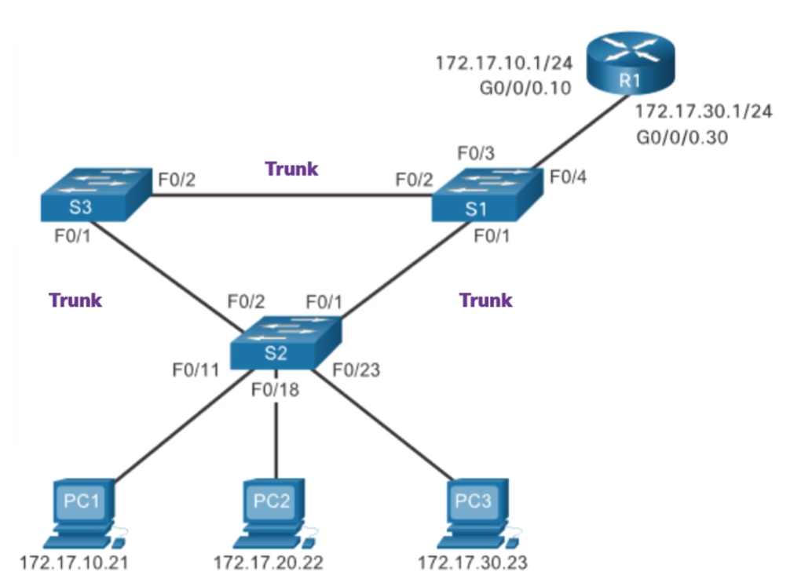

# Настройка пароля и логина в VTY, для подключения по telnet

**Важно вводить пароль, иначе доступ к устройству будет потерян**

# Отключение логов в терминале
```
Router(config)# line console 0

Router(config-line)# logging synchronous
```

# Отключение разрешения доменов при вводе неверных команд


# Создание loopback интерфейса и пингование других интерфейсов с помощью loopbcak
## Создание loopback интерфейса
``` 
Router(config)# interface Loopback0
Router(config-if)# ip address 10.0.0.1 255.255.255.255
Router(config-if)# no shutdown
```
## Пингование интерфейсов с loopback интерфейса

```
Router# ping 192.168.1.1 source Loopback0
```


# Ipv_4
### Статическое назначение адресов

```
R(config-if)#ip address network_address mask
```
### настройка DHCP_v4 сервера
```
R(config)# ip dhcp excluded-address low_address [high_address]

R(config)# ip dhcp pool pool_name

R(dhcp-config)# network network_address[mask | /prefix-legnth]

R(dhcp-config)# default-router address   [ address2 ... addres8 ]

R(dhcp-config)# lease {days [hours [minutes]]   |   infinite}

R(config-if)# ip helper-address address

```

* *ip dhcp excluded-address low_address [high_address]* - указываем ip адреса, которые не будут выдавать DHCP сервером

* *ip dhcp pool pool_name* - создаём пул и сразу же переходим к его настройке

* *network network_addres[mask | /prefix-legnth]* - задаем пул с помощью сети. Именно из неё dhcp сервер будет брать адреса для выдачи 

* *default-router address [ address2 ... addres8 ]* - указываем адрес маршрутизатора по умолчанию(можно указать до 8 маршрутизаторов)

* *lease {days \[hours \[minutes\]\] | infinite}* - задаём время аредны ip адресов
  * Если не задать то по умолчанию ареса выдаются на сутки

* *R(config-if)# ip helper-address address* - включение ретрансляции для маршрутизации широковещательного трафика для нормальной работы dрсp
  * в качестве address указывается ip адрес dhcp сервера
  
  * настройка позволяет ретранслировать широковещательный служенбый трафик(сообщения протоколов, использующие транспортный протокол UDP) через маршрутизаторы. 

### настройка dhcp_v4-клиента 
```
R(config-if)# ip address dhcp
```

* *R(config-if)# ip address dhcp* - указываем, что получаем ip адрес от dhcp сервера

### Проверка настроек DHCP_v4 сервера

```
R1# show running-config | section dhcp
```
* показывает исключенные из выдачи ip адреса, название пула, сеть из которой выдаются адреса, ip адрес роутера по умолчанию, адрес dns сервера, доменное имя

```
R1# show ip dhcp binding
```
* показывает привязку ip адресов к mac адресам

```
R1# show ip dhcp server statistics
```
* показывает инфу о переданных пакетах

```
ipconfig \all
```
* чтобы проверить какой адрес выдал dhcp сервер на хосте

```
R1(config)# no service dhcp
```
* команда отключает сервис dhcp на маршрутизаторе, т.е после неё он перестанет работать в режиме dhcp сервера

* **сервис dhcp запущен по умолчанию**

### Добавление статических маршрутов

```
R(config)# ip route network-address subnet-mask {ip-address | exit-intf} [distance]
```
* Если добавить distance, то маршрут станет **плавающим**
  * плавающие маршруты добавляются в таблицу маршрутизации по мере необходимости. Например когда основной маршрут, стал не доступен
  
  * Они хранятся в конфигурации
* в кавычках указан ip адрес сети либо интерфейс, которые нужно переслать пакет

## Ipv_6 

## Немного про адреса

* **global unicast** (2000::/3)

* **link-local-address** (fe80::/10)

* **unique-local** (fc00::/7 и fd00::/8)


## статическое назначение IpV6 адресов


## Динамическое назначение ipv6 адресов

### Флаги

**Флаг Autoconfiguration(A)**

* Разрешает slaac 

**Флаг managed Configuration (M)**

* Указывает на то, что надо использовать DHCPv6

**Флаг Other Configuration (O)**

* Пользуемся комбинацией DHCPv6 без хранения состояния (SLAAC + DHCPv6)

**Когда используем обычный slaac флаги O и M обнулены**

**Когда хотим использовать сервер DHCP, то нужно включить один из флагов M или O**


### SLAAC

необходимо предварительно включить маршрутизацию ipv6 адресов, чтобы у маршрутизатора появилась подписка на адрес FF02::2. Это нужно для обмена RA и RS сообщениями

```
R1#ipv6 unicast-routing
```

**флаг A = 1 M = 0, O = 0**

### SLAAC + DHCP (сервер)

Solicit(host)

Advertise(dhcp сервер)

Information Request(host)

Reply(dhcp сервер)

```
R(config)# ipv6 unicast-routing
R(config)# ipv6 dhcp pool POOL_NAME
R(config-if)# ipv6 dhcp server POOL_NAME
R(config-if)#ipv6 nd other-config-flag
```
* *R(config)# ipv6 unicast-routing* - включаем маршрутизацию ipv6 адресов

* *R(config)# ipv6 dhcp pool POOL_NAME* - создаём пул. 
  * Т.к у нас stateless dhcp, то никаких адресов не добавляем.
  * В пул можно внесте доп инфу, по типу адреса dns сервера и доменного имени
    * *R(config-dhcpv6)# dns-server ipv6_address*
    * *R(config-dhcpv6)# domain-name name*  

* R(config-if)# ipv6 dhcp server POOL_NAME
  * привязываем пул к интерфейсу маршрутизатора, подключенного к локальной сети с клиентами

* *R(config-if)#ipv6 nd other-config-flag* включаем флаг O

**флаг A = 1 M = 0, O = 1**

### SLAAC+DHCP(клиент)
```
R(config)# ipv6 unicast-routing
R(config-if)# ipv6 enable
R(config-if)# ipv6 address autoconfig
```

* *R(config)# ipv6 unicast-routing* - настраиваем IPv6 маршрутизацию

* *R(config-if)# ipv6 enable* - команда генерирует LLA на интерфейсе маршрутизатора

* *R(config-if)# ipv6 address autoconfig* - команда настраивает slaac на интерфейсе


### DHCP(сервер)

Solicit(host)

Advertise(dhcp серве)

Request(host)

Reply(dhcp сервер)

```
R(config)# ipv6 unicast-routing
R(config)# ipv6 dhcp pool POOL_NAME
R(config-dhcpv6)# address prefix prefix/prefix_length
R(config-dhcpv6)# dns-server ipv6_address
R(config-dhcpv6)# domain-name name
R(config-if)# ipv6 dhcp server POOL_NAME
R(config-if)# ipv6 nd managed-config-flag
R(config-if)# ipv6 nd prefix default no-autoconfig
```

* *R(config)# ipv6 unicast-routing* - включаем маршрутизацию на интерфейсе

* *R(config)# ipv6 dhcp pool POOL_NAME* - создаём пул и сразу переходим в его настройку(сеть, dns сервер, доменное имя)

* *R(config-dhcpv6)# address prefix prefix /prefix_length* - задали сеть, из которой dhcp сервер будет выдавать адреса

  * R(config-dhcpv6)# dns-server ipv6_address

  * R(config-dhcpv6)# domain-name name

* *R(config-if)# ipv6 dhcp server POOL_NAME*
  * привязываем пул к интерфейсу, на котором будет работать dhcp сервер

* *R(config-if)# ipv6 nd managed-config-flag* включаем флаг M

* *R(config-if)# ipv6 nd prefix default no-autoconfig* - отключаем флаг A
   
**флаг A = 0 M = 1, O = 0**

### DHCP(клиент)

```
R(config)# ipv6 unicast-routing
R(config-if)# ipv6 enable
R(config-if)# dhcp ipv6 address
```

* *R(config-if)# ipv6 nd prefix default no-autoconfig* - включаем IPv6 маршрутизацию

* *R(config-if)# ipv6 enable* - настраиваем LLA на интерфейсе

* *R(config-if)# dhcp ipv6 address* - настраиваем использование dhcp сервера

### Проверка настроек DHCPv6 сервера

```
R# show ipv6 dhcp pool
```
* позволяет посмотреть выданные адреса

```
R# show ipv6 dhcp binding
```
* позволяет посмотреть привязки LLA-GUA

```
R(config-if)# ipv6 dhcp relay destination dhcp_server_address interface
```

* вместо dhcp_server_address нужно указать ipv6 адрес dhcp сервера, вместо interface - интерфейс, ведущий к dhcp серверу
  
* Трансляция настраивается на интерфейсе, подключенном к граничной локальной сети, из которой нужно будет ретранслировать широковещательный трафик. 
  * широковещательный всмысле FF02::2 

## Добавление маршрутов по умолчанию

```
R(config)# ip route 0.0.0.0 0.0.0.0 {ip-address | exit-intf}
```
* Вообще вместо адреса 0.0.0.0 можно указать любой другой. Главное чтобы маска была 0.0.0.0

## Настройка динамической маршрутизации (RIPv2)

```
R(config)# router rip
R(config-router)# no auto-summary
R(config-router)# version 2 
R(config-router)# network ip_network 
R(config-router)# passive-interface intf_name
R(config-router)# default-information originate
```
* *ip_network* - перечисляем сети, о которых настраиваемый маршрутизатор будет рассказывать при маршрутизации

* *passive-interface* - указываем пассивные интерфейсы(не 
* **default-information originate** - позволяет обмениваться инфой о маршрутах по умолчанию 
  
* *no auto-summary*. Отключаем процесс, при котором маршрутизатор объединяет несколько подсетей в одну большую сеть при отправке маршрутов другим роутерам 

* *version 2*. Меняем версию протокола на вторую. Необходимо изменить версию на всех маршрутизаторах, находящихся в одном домене маршрутизации

# Вывести инфу о настроенных протоколах маршрутизации
```
Router# show ip protocols
```

# CDP

**CDP запущен по умолчанию**
```
R(config)# no cdp run
```
* отключение протокола cdp на устройстве

```
R(config-if)# no cdp enable
```
* отключает получение и отправку cdp сообщений на настраиваемом интерфейсе

```
R#show cdp neigbours [detail]
```
* просмотр cdp таблицы
* 

```
show cdp entry {* | device-name [protocol | version]}
```

* просмотр подключенных соседей


# LLDP

**по умолчанию выключен**

```
R(config)# lldp run
```
* Включение lldp на роутере

```
R(config-if)# lldp transmit
R(config-if)# lldp receive
```
* настройка передачи lldp пакетов
  
  * R(config-if)# lldp transmit - разрешает передачу с настраиваемого интерфейса
  
  * R(config-if)# lldp receive - разрешает принимать сообщения на выбранном интерфейсе

```
R# show lldp
```

* проверка lldp


```
R# show lldp neighbors [detail]
```

* показывает обнаруженные соседние устройства
* 

# NTP

```
R# clock set hh:mm:ss {day month | month day} year
```

* Задаём время вручную

```
R# show clock [detail]
```
* Просмотр текущего времени и способа настройки

```
R(config)# ntp server ip-address
```
* ip-address - адрес устройства, от которого будем получать информацию о времени, находящегося на 1 Stratum уровень выше

```
R(config-if)# ntp broadcast
```

* Интерфейс, на котором проводим эту настройку, должен быть подключен к следующим сетевым устройствам в локальной сети

```
R (config) # ntp master [stratum]
```

* Настраиваем маршрутизатор как stratum сервер, рассылающий ntp сообщения

## Проверка NTP

```
R# show ntp associations
```
* 

```
R# show ntp status
```
* 


# Syslog

Уровень важности сообщений


Логи это определенные события на устройствах. Логи поделены на уровни, причем **чем меньше значение уровня, тем важнее и серьезнее сообщение.**


```
R (config)# service timestamp log datetime
```
* Настройка временной метки. 
* datetime подразумевает, что время на устройстве синхронизируется с помощью протокола NTP

```
R(config)# logging console
```

* Вывод журнала логов в консоль

```
R(config)# logging buffered
```

* сохранение логов в буфер

```
R# show logging
```

* просмотр журнала

## Отправка сообщений на выделенный syslog сервер

```
R(config)# logging host
```
* вместо host указываем ip адрес сервера, на который хотим отправлять лог-сообщения

```
R(config)# logging trap level
```
* Настройка отправляемых сообщений
* вместо level указывается номер уровня, начиная с которого нужно отправлять сообщения на сервер(т.е этот номер и всё что меньше) нужно сделать, чтобы отправлять не все сообщения, а только некоторых типов

```
R(config)# logging source-interface interface-type interface-number
```
* информация об интерфейсе(его ip адрес) источника будет прикреплена к лог сообщению и отправлена на syslog сервер. Это не влияет на то, с какого интерфейса будут отправляться лог сообщения.

# Работа с файловой системой

```
R# show file systems
```

* Показать доступные файловые системы на роутере

* Также будет инфа о месте, свободном месте, флагах разрешения (r,w,wo,ro)

* работает как на свитче, так и на роутере

* звездочка указывает на файловую систему по умолчанию

* \# указывает, что в этой фс хранится ос(только для роутеров)
```
R# dir
```

* покажет содержимой текущей файловой системы

```
cd dir_name
```

* позволяет перемещаться в директорию dir_name

```
pwd
```

* Команда pwd возращает путь до текущей файловой системы

# Восстановление пароля на устроствах 

## Роутер

1. Войдите в режим ROMMON
   * ROMMON - это режим начального загрузчика, на этом этапе не загружена ОС и конфигурация
   
   * Используя специальную комбинацию клавиш (ctrl + break в PuTTY) вводим прерывание во время процесса загрузки. Лучше использовать прерывание
   
   * 
  
2. Измените значение регистра конфигурации
   * Установить регистр конфигурации 0x2142, для игнорирования загрузочной конфигурации

   * Регистр 0x2142 скажет устройству игнорировать загрузочную конфигурацию, т.е файл startup-config будет проигнорирован при загрузке маршрутизатора.
   
   * ресетим устройство
   
   * 

3. Скопируйте startup-config в running-config
   * Сейчас мы перезагрузились, но у нас пустая конфигурация, поэтому нужно скопировать startup-config в running-config
   * 

4. Измените пароль
   * Изменяем пароль
   * 

5. Сохраните running-config как новый startup-config
   * Сохраняем настройки
   * Изменить значение регистра конфигурации обратно на 0x2102 с помощью команды config-register 0x2102 в режиме глобальной конфигурации
   * 
6. Перезагрузите устройство
   * ```R# reload```

## Коммутатор
1. Подключиться по консоли

2. Отключить кабель питания

3. Подключить кабель питания и в течение 15 секунд удерживать кнопку mode

4. Подождать сигнал индикатора SYST: моргнет желтым, а затем загорится постоянный зеленый

5. Увидеть запрос switch:

6. Команда set показывает значение boot, команда flash_init инициализирует flash

На самом деле алгоритм такой же как и у маршрутизаторов, т.е заставить коммутатор загрузится с игнорированием загрузочной конфигурации, но махинация с регистрами тут не прокатит. Поэтому можно назвать загрузочный файл так, чтобы коммутатор не узнал в нем загрузочного файла, т.е просто переименовать найденный конфигурационный файл(Запомни новое имя), после чего коммутатор загрузится с чистого листа.

Дальше работаем также как и с роутером

т.е помещаем startup-config в running-config
поменять пароли
сохранить новые данные

# Резервное копирование образа ОС

Копируем образ ос на удаленный сервер


# Восстановление обрза ОС

Скачиваем образ ОС с удаленного сервера, предварительно проверив, что есть свободное место


После этого нужно изменить переменную **boot system**, определяющую в каком порядке нужно загружать образы ОС
* Порядок нужен для отказоустойчивости, т.е если образ ос отсутсвует, то устройство могло загрузить другой

Меняем значение переменной boot, указывая в неё путь до того образа, с которого хотим загрузиться


* При загрузке устройство ищет первый доступный файл образа ОС, если в переменной boot нет никаких значений

После изменения переменной boot необходимо сохранить загрузочную конфигурацию 

```
copy running-config startup-config
```

Затем перезагружаем устройство


```
R# show version
```
* показывает версию ос, запушенную на устройстве

# VLAN

## Создание VLAN
```
S(config)# vlan vlan_id // vlan_id - это номер VLAN
S(config-vlan)# name vlan_name // vlan_name - даём имя, чтобы при просмотре конфигурации его было проще отследить 
S(config-vlan)# exit
```

* Создаём VLAN

## Проверка настройки VLAN 

```
S# show vlan brief
```

* просмотр данных о vlan

```
S1# show vlan summary
```

* показывает кол-во созданных vlan. В том числе рассширенных(у тех у которых id больше 1005)

```
S1# show vlan name vlan_name
```

* просмотр настройки конкретной vlan с именем *vlan_name*

```
S1# show interfaces interface_name switchport 
```

* показывает режим работы интерфейса, тут тоже можно посмотреть в каких vlan он находится

**После создания vlan, в них нужно поместить порты, иначе нифига работать не будет**

## Добавление access портов в VLAN
```
S(config-if)# switchport mode access 
```

* включаем режим работы доступа на порте коммутатора, т.е порт ведет к клиентам и будет помещен в какую-то VLAN.

```
S(config-if)# switchport access vlan vlan_id 
```

* Указываем куда помещаем порт, если не вводить эту строку, то порт по умолчанию помещается в VLAN 1

* После такой настройки, интерфейс работает только в этом VLAN

**Режим работы access не рекомендуется использовать для интерфейсов, ведущих к другому сетевому оборудованию**(свитчам и роутерам). Режим access подходит только для работы с клиентами !!!

```
S(config-if)# switchport voice vlan vlan_id
```

* Если к интерфейсу подключена IP телефония, то команда добавления порта в VLAN будет такой:

## Удаление VLAN
```
S1(config-if)# no switchport access vlan
```

* Чтобы вернуть интерфейс в значение по умолчанию(т.е в VLAN 1)

```
S(config-if) no switchport mode access
```

* удаление настройки vlan с интерфейса

```
S(config)# no vlan vlan_id
```

* удаляем сеть vlan с номером *vlan_id*
* Прежде чем удалять VLAN, необходимо все интерфейсы, находящиеся в этой VLAN перенести в другой VLAN. **Если сначала удалить VLAN,то интерфейсы, которые были в этой vlan станут неактивными**.

```
S# delete flash:vlan.dat
```
* удаляем все vlan сети, т.к в этом файле хранятся данные о настройке всех vlan из стандартного диапозона

## Настройка trunk портов

```
S(config-if)# switchport mode trunk
```
* указываем, что интерфейс работает в транковом режиме

```
S(config-if)# switchport trunk encapsulation dot1q
```

* указываем инкапсуляцию, в которой будет работать порт. Это тот самый протокол, который добавляет доп заголовок с тегом в заголовок кадра ethernet

```
S(config-if)# switchport trunk native vlan vlan_id
```

* указываем номер vlan, который будет использоваться в качестве native vlan. **По умолчанию native vlan это первая vlan**

```
S(config-if)# switchport trunk allowed vlan vlan_list
```

* задаём список номеров VLAN, которые могут осуществлять передачу трафика по настраевому интерфейсу.**По умолчанию на транковом интерфейсе разрешен весь трафик**

## Проверка транковых портов

```
S# show interfaces interface_id switchport
```

* можем вывести все настройки конкретного VLAN

Важно обращать внимание на Operational mode, который показывает фактический режим работы порта.

**необходимо чтобы на одном канале связи с двух сторон были одинаковые настройки транкового порта**, **иначе транк порт не сможет нормально работать**

```
S# show interfaces trunk
```

* позволяет просматривать настройки транков(какие порты относятся к транковым портам, какие vlan разрешены в транковых портах)


## Сброс транковых портов

* порт останется транковым и будет перемещен в 1 vlan(vlan по умолчанию)


* чтобы полностью сбросить режим trunk с порта, то нужно поместить его в access mode

## Способы маршрутизации между VLAN

### 1 vlan - 1 порт роутера(старый метод)


Настройка коммутатора Создаём vlan

```
S(config) # vlan vlan_id

S(config-vlan) # name vlan_name
```
помещаем порт коммутатора в vlan с vlan_id
```
S(config)# interface interface_id

S(config-if)# switchport mode access

S(config-if)# switchport access vlan vlan_id
```
Настройка маршрутизатора

нужно только настроить интерфейс, присвоив ему ip адрес.

```
R(config)# interface interface_id

R(config-if)# ip address ip_address subnet_mask

R(config-if)# no shutdown
```

### Router-on-a-stick



Создаём vlan

```
S(config) # vlan vlan_id

S(config-vlan) # name vlan_name
```
помещаем порт коммутатора в vlan с vlan_id

```
S(config)# interface interface_id

S(config-if)# switchport mode access

S(config-if)# switchport access vlan vlan_id
```
выделенный интерфейс коммутатора, ведущий к роутеру, настраиваем в режиме Trunk.

на транковом интерфейсе необходимо создать native vlan, а также задать разрешенные vlan, см как это делать ранее

```
S(config)# interface interface_id

S(config-ig)# switchport mode trunk
```

**Настройка маршрутизатора**:

Настраиваем интерфейс роутера, который связан с транковым портом коммутатора. На этом интерфейсе для каждого VLAN создаём подинтерфейсы (виртуальные интерфейсы на базе одного физического интерфейса)


```
R(config)# interface interface_id.subinterface_id
```

* Разбиваем физический интерфейс на виртуальные подинтерфейсы Сам физический интерфейс мы не настраиваем, но нужно его включить Номер подинтерфейса совпадает с номером VLAN, для которой он был создан, для удобности восприятия

* После переходим в режим config-subif - режим настройки подинтерфейса

```
R(config-subif)# encapsulation dot1q vlan_id
```

* Указываем режим инкапсуляции, а также номер vlan, к которой относится настраиваемый подинтерфейс

```
R(config-subif)# ip addpress ip_address subnet_mask
```

* настраиваем адрес сети, адрес ip адрес интерфейса, который будет шлюзом для этой сети


### Проверка подынтерфейсов

```
R# show ip route
```

```
show ip interface brief
```


```
show interfaces interface_name.subinterface_name
```

* покажет состояние конкретного интерфейса

```
show interfaces trunk
```
* проверка транковых портов на коммутаторе


### Настройка L3 коммутатора


Создание VLAN:
```
S(config) # vlan vlan_id

S(config-vlan) # name vlan_name
```
Настройка интерфейса SVI:
```
S(config) #interface vlan_id

S(config-if)#ip address ip_address subnet_mask

```
Включение маршрутизации
```
S(config)# ip routing

```
нужно включить, т.к по умолчанию она отключена


## исправление ошибок в VLAN


1. Смотрим создались ли нужные vlan на свитчах s1 и s2
2. Cмотрим настроены ли интерфейсы для связи с клиентами в режим доступа с нужными vlan
3. Внимательно следи за транковыми портами, настройка транковых портов на противоположных концах должна быть одинаковой(те же allowed vlan, та же native vlan и тд)
4. В маршрутизаторе R1 следим, чтобы интерфейс g0/0/1 был разлелен на соответствующие подинтерфейсы и на них была настроена инкапсуляция
5. Нужные интерфесы vlan имеют нужные ip адреса
6. Нужно посмотреть, что ip адреса на компах принадлежат своим сетями
