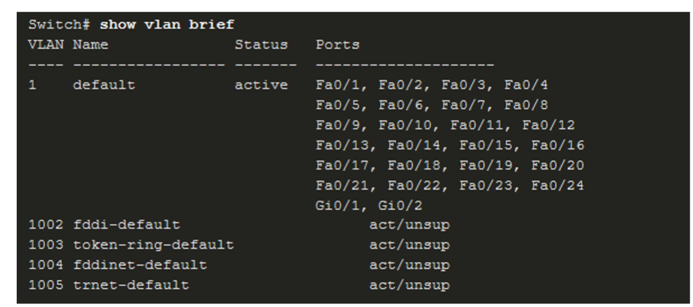
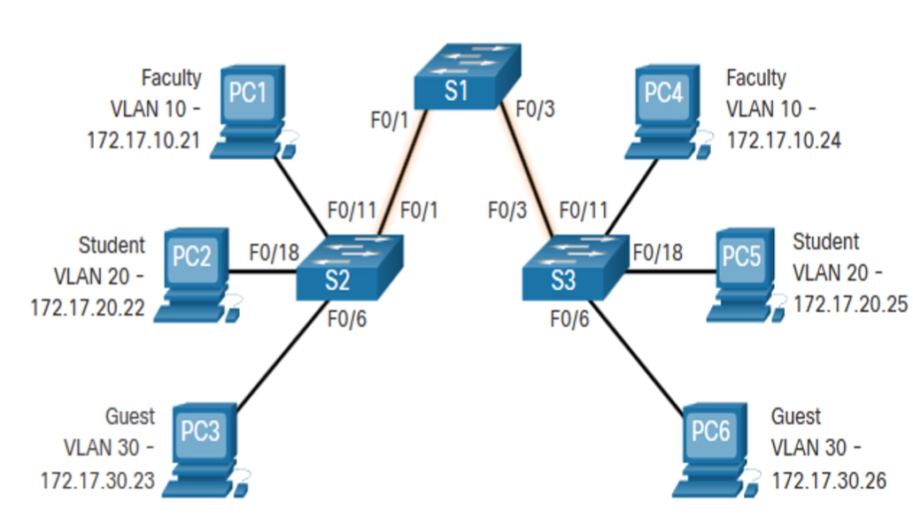
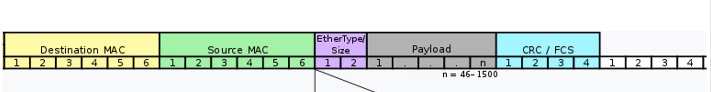
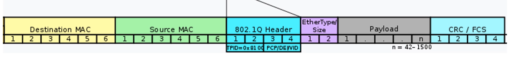
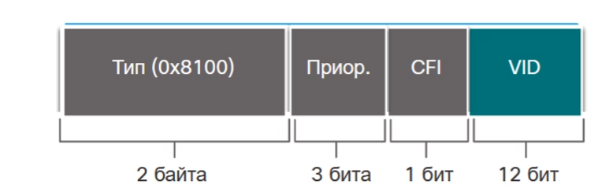
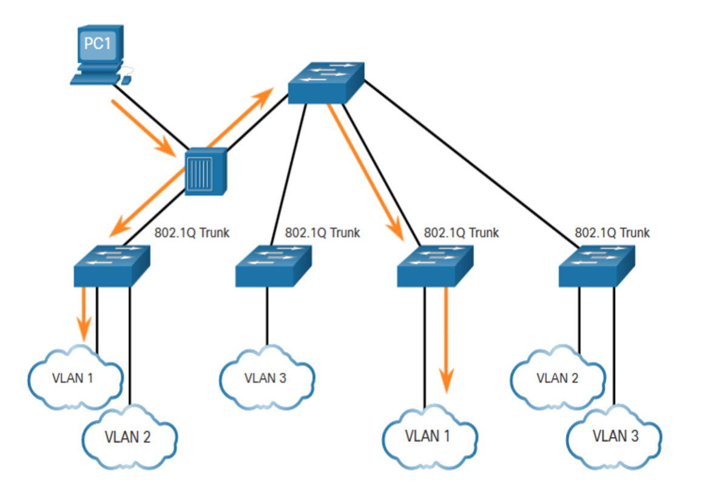
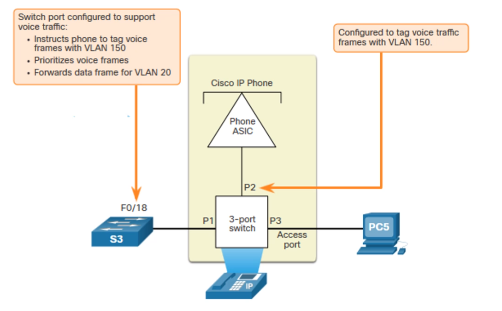
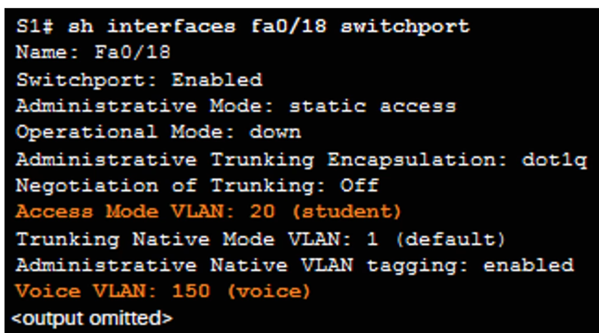
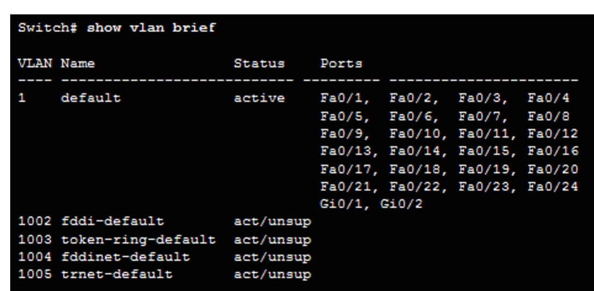

# Network Design

## [Конвергентные сети](https://servergate.ru/articles/konvergentnye-sistemy/)

Современные сети могут передавать различный пользовательский трафик по одному каналу связи. Передача голоса и видео по одной сети
Доп Сервисы:
* Управление вызовами
* Голосовые сообщения
* Мобильная связь
* Автоответчик

Плюсы:
* Одна физическая сеть для разного типа трафика, что экономит деньги, очевидно, т.к не нужно проводить 100500 каналов, каждый для своего типа трафика

Минусы:
* Требуется продуманная архитектура и структурированное проектирование, т.к нужно умело согласовать передачу всех типов трафика.

## [Borderless Network](https://genesisbcs.com/cisco-borderless-network-architecture/)

* Предоставляет платформу для объединения средств проводного и беспроводного доступа, включая применение политик(безопасности), разграничение доступа и управление производительностью устройств разных типов
* Строится на основе масштабируемой и отказоустойчивой иерархической инфраструктуры аппаратного обеспечения
* Пользователи получают повсеместный доступ к ресурсам в любое время
* Должно быть централизованное администрирование таких сетей, которое не должно усложняться с ростом сети
* Способна передавать конвергированные данные

С помощью такой сети можно связывать пользователей любых устройств в любое время в любом месте. Не обязательно должна быть кампусная сеть в одном здании организации. Могут быть удаленные подключения, могут быть мобильные пользователи, которые могут удаленно подключаться в локальную сеть организации.  

Может существовать сеть филиалов, которые объединены одной локальной сетью.

## Принцип построения Borderless Network

* **Иерархичность**
  * Делим сеть на разные уровни, имеющие свои роли. Такое разделение упрощает понимание роли устройства на каждом уровне
  * Иерархичную сеть проще поддерживать, т.к на каждом уровне находится своё оборудование, которое изолировано от оборудования на других уровнях.
* **Модульность**
  * легко масштабировать и внедрять новые сервисы
* **Отказоустойчивость**
  * бесперебойная работа сети. Пользователи ожидают, что ресурсы сети(сервисы) будут доступны постоянно
* **Гибкость**
  * рациональное распределение ресурсов. Каждому пользователю достаётся столько ресурсов, сколько ему реально нужно
  
## Borderless Switched Network

В основе построения таких сетей лежат 2 модели:
1. **Трёхуровневая модель**
   1. 
   2. Подразумевается, что архитектура сети делится на 3 уровня:
      1. Аccess Layer
      2. Distribution Layer
      3. Core Layer
2. **Двухуровневая модель**
   1. 
   2. Похожа на 3 уровневую модель, только Core Layer и Distribution Layer схлопнуты в один уровень Collapsed Layer
   3. Такая модель больше подходит для организаций меньшего размера, с меньшим кол-вом трафика

## Access Layer, Distribution Layer, Core Layer

* **Уровень доступа(Access Layer):**
  * Предоставление доступа пользователю
  * К нему подключаются пользовательские устройства
  * Коммутаторы уровня доступа подключаются к устройствам уровня распределения
* **Уровень распределения(Distribution Layer)**
  * Маршрутизация трафика между подсетями
  * Агрегация трафика
  * Предоставляются услуги по качеству обслуживания для каждого типа трафика. Например повышенное качество аудио сообщений, т.к такой тип трафика не терпит потерь данных
  * Политики доступа(Qos)
* **Уровень Ядра(Core Layer)**
  * Магистраль сеть
  * Через этот уровень происходит объединение с другими сегментами сети, например предоставляется выход в сеть Интернет, а также другие большие части сети нашей организации, например сети фелиалов или разных кампусов
  * Обеспечивает изоляцию сбоев и высокую скорость подключения между большими сегментами сети
  
## Выбор архитектуры
Нужно уметь правильно выбирать архитектуру сети

* 3 уровневую модель рекомендуется использовать для больших организаций, у которых есть несколько филиалов или кампусов. Тогда в главном офисе нужно развернуть уровень ядра, к которому будут подключаться уровни распределения, находящиеся в разных кампусах организации. Либо можно сделать уровень ядра в каждом филиале, а потом связать крупные сегменты сети
* используется при интенсивном обмене трафиком в организации
* подразумевает более большие затраты на оборудование. Например для обеспечения отказоустойчивости необходимо дублировать оборудование и каналы связи, плюс логично, что чтобы обеспечить адекватную работу целых 3 уровней понадобится большое кол-во разных устройств, что может быть дороговато

* менее простая, дешевая и легковесная модель, может не обеспечить хорошим качеством сети
* Рекомендуется для организаций среднего и малого размера, которые находятся внутри одного здания. 
* используется при умеренном или малом обмене трафиком в организации

## Плоские сети

До изобретения крутых и навороченных сетевых архитектур, все подключения проходили в плоских сетях в которых все пользователи были соединены друг с другом одним кабелем(общая шина), либо через коммутатор.
  
Плоская сеть не очень хороший вариант, т.к пользователи могут получать большой объем трафика, который им не предназначается и не требуется для работы, что увеличивает нагрузку на пропускно канал сети, что тормозит сеть

## Иерархические сети

Когда мы делим сеть на уровни, то мы получаем дополнительную гибкость, а именно возможность:
* управлять трафиком,
* ограничивать распространения трафик,
* предоставлять различное качество обслуживания для разных типов трафика,
* обеспечивать политики безопасности 
* подключения беспроводных клиентов и других сервисов по типу IP телефония, мобильная связь
  
В иерархических сетях кроме коммутаторов используются ещё и маршрутизаторы, коммутаторы [3его уровня](https://habr.com/ru/companies/zyxel/articles/531498/) и другие технологии

[Ещё одна статья про коммутатор L3](https://www.fibermall.com/ru/blog/layer-3-switches.htm?srsltid=AfmBOooto7YxQZVkV_UbzDlQh6cFr-kKIDg_iNV_W_iKDvWrX-zRAUsY#)

## Продумывание сети
Чтобы сеть отвечала принципам **Иерархичности, Модульности, Отказоустойчивости, Гибкости** нужно заранее спланировать её архитектуру и то как она будет реализована.
  
Например для обеспечения отказоустойчивости необходимо дублировать разные типы оборудования и каналы связи на уровнях, что позволит создать резервные пути для прохождения трафика. Нужно делать это с умом, т.к может влететь в копеечку, и обеспечивать отказоустойчивость только стратегически важных компонент сети
  

С помощью [агрегирования портов](https://nag.wiki/pages/viewpage.action?pageId=25108332#:~:text=%D0%90%D0%B3%D1%80%D0%B5%D0%B3%D0%B8%D1%80%D0%BE%D0%B2%D0%B0%D0%BD%D0%B8%D0%B5%20%D0%BF%D0%BE%D1%80%D1%82%D0%BE%D0%B2%20%2D%20%D1%8D%D1%82%D0%BE%20%D0%BF%D1%80%D0%BE%D1%86%D0%B5%D1%81%D1%81%20%D0%BE%D0%B1%D1%8A%D0%B5%D0%B4%D0%B8%D0%BD%D0%B5%D0%BD%D0%B8%D1%8F,%D0%BB%D0%BE%D0%B3%D0%B8%D1%87%D0%B5%D1%81%D0%BA%D0%BE%D0%BC%20%D0%BB%D0%B8%D0%BD%D0%BA%D0%B5%20%D0%B8%20%D0%B8%D1%81%D0%BF%D0%BE%D0%BB%D1%8C%D0%B7%D0%BE%D0%B2%D0%B0%D1%82%D1%8C%20%D1%80%D0%B5%D0%B7%D0%B5%D1%80%D0%B2%D0%B8%D1%80%D0%BE%D0%B2%D0%B0%D0%BD%D0%B8%D0%B5.), можем расширить возможности каналов связи, т.е увеличивать пропускную способность одного канала связи между устройствами

Использование протоколов маршрутизации ([OSPF](https://ru.wikipedia.org/wiki/OSPF)) , поддерживающих иерархию устройств в сети, и иерархических сетевых адресов.
  
Подключение беспроводных точек доступа для увеличения числа клиентов

легкое масштабирование иерархических сетей, т.к на выделенных уровней можно просто добавить побольше оборудования.

## Выбор оборудования

### Харатеристики коммутаторов 

Высота коммутаторов в стойках измеряется в юнитах, где юнит это высота одного коммутатора

* [Формфактор](https://cisco.nitaet.com/ccna-2-rs-ru/course/module1/1.1.2.2/1.1.2.2.html)
  * конфигурация со стеком. Нескольно отдельных коммутаторов с помощью специальных кабелей объединяются в один большой коммутатор, позволяя суммировать возможности всех коммутаторов. Увеличивается кол-во портов, увеличивается вычислительная мощность и кол-во пямяти за счёт увеличения числа ЦП и памяти в коммутаторах
  * конфигурация без стека.
  * конфигурация модульная. Могут менять свой форм-фактор за счёт подключения дополнительных плат с портами. Можно производить горячую замену плат, когда это потребуется
  * конфигурация фиксированная. Имеют строго заданный набор характеристик(размер коммутатора, кол-во портов, доступные опции)
  
* Плотность портов, т.е кол-во портов, доступное на одном свитче.
  * на свитчах с фиксированной конфигурацией распространено 24 и 48 кол-во портов
  * на модульных свитчах за счёт добавления плат может достигаться большое кол-во портов

* Питание (поддержка PoE Power Over Ethernet), т.е коммутатор способен принимать питание через ethernet кабель
  * Такая опция требуется небольшим сетевым устройствам, работающим по сети. Например ip камера, точка доступа
  * Наличие этой функции сильно экономит трудозатраты и место при монтировании оборудования, т.к необходимо протягивать дополнительный кабель питания.

* Надежность

* Скорость портов(передачи данных)
  * в местах где пользователь подключается к сети можно использовать порты со скоростью от 100 Mbit/s
  * в местах агрегации сети важно использовать порты с высокой пропускной способностью, т.к это может стать Bottle neck ом сети

* Размер буфера порта, кол-во данных, которое может быть сохранено в буфере порта прежде чем отправиться в сеть
  * Этот параметр играет роль, когда по сети отправляется очень большое кол-во трафика, когда коммутатор не успевает отправлять трафик по сети, и ему приходится отбрасывать пакеты, не поместившиеся в буфер 

* Масштабируемость(Способность коммутатора добавлять новых пользователей)
  * У коммутатора с фиксированной конфигурацией таких возможностей меньше, т.к ограниченное кол-во портов
  * У модульных коммутаторов функция масштабируемости встроена по умолчанию, т.к можно динамически менять кол-во портов в зависимости от задач 

* Стоимость 
  * все вышеперечисленные функции прямо влияют на стоимость коммутатора
  * чем больше технологий, которые поддерживает коммутатор, тем больше его стоимость, тут всё просто :) 
  * Поэтому перед установкой коммутатора стоит подумать, о том, пригодятся ли его функции в том сегменте сети, куда мы собираемся его установить, не будут ли его функции излишни.

### Плотность портов
Коммутаторы с фиксированной конфигурацией поддерживают различные варианты плотности портов. Обычно это 12, 24, 48 портов

    
Модульные Коммутаторы поддерживают очень высокую плотность портов за счёт добавления нескольких линейных плат портов коммутатора. Могут поддерживать свыше 300 портов, но такое кол-во не всегда нужно.

 

### Выбор коммутаторов для различных уровней иерархической сети

Для **уровня доступа**:
  * лучше всего подходят модульные коммутаторы(кол-во пользователей измеряется сотнями и не подходит беспроводная сеть) либо берем такое кол-во L2 коммутаторов с фиксированной конфигурацией с плотностью портов, достаточной для подключения всех пользователей
  * Очень хорошо подходят свитчи с PoE, т.к на этом уровне идёт подключение Ip телефонии, точек доступа

Для **Уровня распределения**:
  * Здесь функция PoE уже не критична, т.к на этом уровне не подключаются точки доступа
  * Очень критична функция обеспечения маршрутизации. Поэтому L2 коммутатор не подходит
  * Лучше выбирать коммутаторы с большей производительностью и вместительностью буфера портов, скоростью портов. Т.к на уровне распределения происходит интенсивная передача трафика
  * Лучше подходят L3 коммутаторы, поддерживающие функцию маршрутизации
  * Очень редко можно использовать роутеры, но это меннее предпочтительный вариант, т.к роутер передаёт трафик медленее чем L3 свитч. Это связано с тем, что коммутатор может производить коммутацию на аппаратном уровне, роутер же маршрутизирует пакеты только программно

Для **Уровня ядра**:
  * Лучше Подходят L3 свитчи и роутеры
  * Также здесь требуется очень надежное и производительное оборудование, которое может перегонять большие объемы трафика
  * не требуется поддержка PoE

### Выбор коммутаторов для различных типов сетей

**коммутаторы, которые обсуждались выше** подходят для кампусных сетей

**Коммутаторы с облачным управлением** могут обеспечивать виртуальную сеть и виртуальное стекирование коммутаторов. Настройка портов таких свитчей осуществляется через сеть Интернет, без локального вмешательства. Подходит для облачных сетей

**Виртуальные коммутаторы** для виртуальных сетей. Такие коммутаторы используются в ЦОДах

Мощные коммутаторы с возможностью бесперебойной работы и масштабирования инфраструктуры **используются в ЦОДах**

**Коммутаторы операторов связи**. Делятся на 2 группы:
1. Коммутаторы агрегации. Коммутаторы операторского класса, обеспечивающие агрегацию трафика на границе сети
2. Коммутаторы доступа по Ethernet. Предоставляют функции унифицированных сервисов, возмоности виртуализации и функции обеспечения безопасности

## Выбор Маршрутизатора

Маршрутизаторы занимаются маршрутизацией трафика и объединением сетей. Способны сдерживать широковещательный трафик. Предоставляют функции безопасности (фильтрация трафика). Могут группировать пользователей в рамках кампуса и обеспечивать им доступ к ресурсам 
  
Для построения кампусных сетей чаще используют L3 коммутаторы

Маршрутизаторы играют роль границы сетей, шлюза, могут являться частью ядра.

  
Харки коммутатора и маршрутизатора очень похожи

У них так же есть свои:
* плотность портов
* форм-фактор
* Порты могут пропускать трафик с различной скоростью
* стоимость

  
Маршрутизаторы не имеет поддержки PoE, т.к она им не требуется.

Есть маршрутизаторы с коммутирующими модулями либо со встроенными беспроводными модулями, что позволяет им быть точками доступа.
  

**Маршрутизаторы для филиалов** позволяют оптимизировать сервисы на единой базе платформы, обеспечивают оптимальное взаимодействие с инфраструктурой фелиала и глобальной сети, поэтому от таких роутеров требуется надежность, возможность бесперебойной работы и быстрое восстановление в случае поломки

**Граничные маршрутизаторы** позволяют организовать работу по периметру сети. Они должны обеспечивать высокую производительность, предоставлять безопасность и надежность для сервисов. Чаще используется в кампусных сетях, больших сетях, ЦОДах. Они способны бесперебойно обрабатывать большое кол-во трафика на большой скорости

**Маршрутизаторы операторов связи** связывают различных клиентов, расположенных в разных местах города, страны, мира. Требуется использование доп технологий, для обеспечения необходимого качества обслуживания клиентов. Нужна надежность, масштабируемость и оптимизация ресурсов

**Промышленные маршрутизаторы** предназначны для работы в суровых условиях, когда нет возможности расположить их в здании. Они отличаются прочностью и устойчивостью у суровым природным условиям

## ФормФактор маршрутизатора

* Некоторые маршрутизаторы поставляются с прочным и надежным корпусом
  

* Маршрутизаторы могут отличаться по кол-ву портов 
* Бывают модульные маршрутизаторы, которые подходят для больших организаций
* Маршрутизаторы могут поддерживать разную скорость портов
  * Роутер в домашней или небольшой сети может работать со скоростью порядка 1 Gbit/s
  * Роутер в большой сети, ЦОДе будет работать со значительно большей скоростью

# Настройка VLAN(будет общая инфа про VLAN, детальная настройка не рассматривается)
## [VLAN](https://habr.com/ru/articles/319080/) (Virtual Local Area Network)

VLAN - это виртуальная локальная сеть, т.е сеть, с помощью которой можно виртуально разделять компы между собой.
  
До этого рассматривали локальные сети на основе коммутаторов(мол несколько хостов подсоединены к комутатору - вот тебе и локальная сеть. Или можно связать несколько коммутаторов). Но у такое построение локальной сети создаёт некоторые проблемы при передаче трафика и функционировании сети:

* Коммутаторы раздают широковещательный домен, т.е широковещательный трафик будет передаваться всем устройствам в сети. При этом невсегда такой трафик может быть нужен компу. Широковещательный трафик тратит ресурсы сети, что сильно снижает производительность канала связи, плюс оборудованию приходится обрабатывать больше трафика, что также понижает его производительность

Решить проблему помогает технология VLAN:
* Она создаёт отдельную логическую сеть на базе одного коммутатора, т.е можем разделить порты коммутатора на разные виртуальные локальные сети, тем самым разделив подключенные компы на разные локальные сети. Такие компы будут взаимодействовать друг с другом так, как будто они подключены к какому-нить коммутатору

* VLAN Ограничивает широковещательный трафик, теперь такой трафик распространяется только внутри VLAN, а другая часть сети получать такой трафик не сможет.
* Один порт коммутатора может принадлежать одной VLAN, но в один Vlan может входить несколько портов
* Разделение на отдельные сети без использования VLAN не спасает от широковещательной рассылки

## Преймущества VLAN

* Безопасность сети, т.к пакеты не пересылаются в другие локальные сети, также VLAN ограничивает доступ пользователей в сети. Например административные сотрудники находятся в своём VLAN, студенты в своём VLAN, преподы в своём VLAN, Гости в свой VLAN.  
* Снижение расходов на оборудование, т.к приходится покупать меньше коммутаторов за счет удобного разделения на виртуальные сети внутри одного коммутатора.
* Улучшение производительности за счёт уменьшения кол-во трафика
* Уменьшение размера широковещательного домена
* Повышение производительности IT-сотрудников, т.к становится удобнее настравить права у отдельных групп пользователей, а потом просто распределять пользователей по группам

## Типы VLAN

* **Data VLAN**
  * обычный VLAN для пользовательских данных, выделенный для всех пользователей
* **Default VLAN(=VLAN1)**.
  * VLAN, в котором находятся все порты по умолчанию 
  * Он же Data VLAN
  * Есть по умолчанию на свитчах любых производителей.
  * Его нельзя удалить, но можно перенастроить
* **Native VLAN**
  * Используется для нетегированного трафика
  * по умолчанию Native VLAN это VLAN 1, рекомендуется сразу же перенастраивать его 
* **Management VLAN**
  * VLAN выделенный для управления сетью и сетевым оборудованием. Её настраивают так, чтобы она не пересекалась с пользовательским трафиком.
* **Voice VLAN( для VoIP)**
  * VLAN для голосового трафика, для IP телефонов. Рекомендуется выделять под IP телефонию отдельный VLAN.

Разные VLAN можно использовать для учета приоритетов трафика

Для безопасности рекомендуется менять VLAN портов с первого на какие-то другие.
 

На Cisco так же по умолчанию доступны VLAN:
* 1002 fddi-default
* 1003 token-ring-default
* 1004 fddinet-default
* 1005 trnet-default
  
Эти VLAN тоже нельзя удалить, как и первый. Эти VLAN остались в наследство от прошлых типов сетей, которые уже редко используются

## Trunk Port

Основной принцип VLAN заключается в том, что мы все порты распределяем по разным VLAN. Пример смотри скриншот, там студенты и сотрудники факультета находятся в разных VLAN
  
Чтобы была возможность передавать трафик, при этом сохраняя метку VLAN, используется специальный тип портов - Trunk port aka Тегированные порты

Когда мы настраиваем VLAN на портах коммутатора, то только он знает об этой настройке.Но часто сети строятся с использованием нескольких коммутаторов, поэтому один VLAN может быть настроен на 2 и более коммутаторах(см пример VLAN 20. Он настроен на S2 и на S3). Поэтому нам необходимо обеспечить взаимодействие пользователей из одного VLAN с помощью сохранения настройки VLAN при передаче трафика, т.к без доп настроек и оборудования трафик между VLAN передаваться не будет.
  
Для того чтобы можно было передавать информацию о VLAN используются **Тегированные порты**
  

Функции Транка:
* Разрешает несколько VLAN
  * Через Транковый порт разрешена передача нескольких VLAN, в отличии от пользовательских портов, которые могут передавать всего один
* Расширяет сети VLAN по всей сети
  * С помощью транковых портов, мы можем расширить сеть VLANов на несколько коммутаторов
* По умолчанию поддерживает все VLAN
  * По умолчанию, если нет соответствующей настройки, по транковому порту передаётся трафик со всех VLANов
* Поддерживает [802.1Q](https://en.wikipedia.org/wiki/IEEE_802.1Q)
  * Почитай статью по ссылочке. Благодаря этому стандарту всё это чудо прекрасно работает

## Формат кадра

Стандартный кадр Ethernet

Как видно, в кадре Ethernet не предусмотрено место для хранения о настройках VLAN

Кадр Ethernet со стандартом 802.1Q. Он добавил заголовок 802.1Q Header

Расширенный формат кадра c заголовком 802.1q

* **Тип 0x8100** - говорит о том, что используется протокол тегирования 802.1, мол дальше следует инфа о VLAN
* **Приоритет пользователя** - уровень сервиса
* **Идентификатор канонического формата (CFI)** - для Token Ring(устаревший тип сетей, сейчас уже не используется)
* **VLAN-идентификатор** (VID) - задаёт ограничение сверху на номер VLAN(а именно 2^12). В это поле помещается информация о том, из какой VLAN пришёл кадр

После того как тег VLAN был добавлен в кадр Ethernet, все коммутаторы будут смотреть на этот тег и запрещать передачу этого кадра в VLAN, которые не соответствуют этому тегэ

## Native VLAN и тегирование

**Транковые порты ещё называют магистральными портами(магистрали) или тегированными портами**

На транковых портах(магистралях) должны использовать Native VLAN. Native VLAN используется для нетегированного трафика, который попал тегированный канал(магистраль)

Пример с рисунка, допустим, хост отправил трафик через ХАБ, то хаб передаст дальше трафик на все свои порты, не поменяв заголовка кадра Ethernet, в том числе не добавит тега 802.1q. Если этот кадр попадёт на тегированный порт коммутатора, то коммутатор не поймет как с ним работать. В таком случае коммутатор самостоятельно поместит в заголовок кадра тег 802.1q, настроенный для Native VLAN  

Основы магистрали 802.1Q
* Маркировка обычно выполняется на всех VLAN
* Использование Native VLAN было разработано для устаревшего использования. Вообще если на коммутатор попадает нетегированный кадр, то это говорит о том, что сеть плохо построена, нужно найти этот участок и переделать его.
* Если не изменено, VLAN 1 является Native VLAN. Лучше перенастраивать его
* Оба конца магистрального канала должны быть сконфигурированы с одной и той же Native VLAN
* Каждая магистраль настраивается отдельно, поэтому на отдельных магистралях можно иметь разные Native VLAN

  
Протокол 802.1Q может использоваться на разных типах оборудования. Например может быть какой-нить сервер, использующий VLAN, сетевая плата, маршрутизаторы

## Voice over IP

Используется для IP телефонии(телефоны, работающие по Ethernet сети). Внутри ip телефона есть 3 портовый коммуатор, настроенный на то, чтобы комп пользователя мог подключиться к телефону, сам телефон подключался в компьютерную сеть через коммутатор, ну и порт для голосового трафика

Для голосовго трафика требуется:
* Гарантированная пропускная способность
* Высокий приоритет [QoS](https://ru.wikipedia.org/wiki/QoS)
* Возможность избежать заторов
* Задержка менее 150 мс от источника к месту назначения
* Вся сеть должна быть спроектирована для поддержки голосовой связи

Из-за особенностей построения сети с IP телефонией, нарушается правило "1 порт коммутатора - 1 VLAN", т.к по сути в один порт VLAN попадает и пользовательский трафик и голосовой трафик. Естественно, что этот трафик должен быть разделен, поэтому сущетсвует отдельная голосовая VLAN, в которую помещается порт коммутатора и по нему передаются голосовые сообщения, подключенный к телефону и отдельная VLAN для пользовательских данных, в который помещается тот же порт коммутатора, но он уже передаёт пользовательские данные.

На примере видно, что один и тот же порт(Fa0/18) находится в двух разных VLAN(VLAN 20 и VLAN 150)

Эта ситуация **единственное** исключение из правила "1 порт коммутатора - 1 VLAN"

## Диапозоны VLAN

т.к на id VLAN даётся 12 бит, то мы можем настраивать VLAN от 1 до 4094. Все ID VLAN делятся на 2 диапозона:

VLAN стандартного диапозона:
* малые и средние сети
* от 1 до 1005
* от 1002 до 1005 зарезервированы(см пример)
* конфигурация хранится в vlan.dat. Этот файл отдельный от файла конфигурации, поэтому если нужно сбросить коммутатор к заводским настройкам, то будет недостаточно просто удалить файл конфигурации, нужно отдельно удалить vlan.dat. Файл vlan.dat хранится на флеш карте устройства, поэтому после перезагрузке устройства данные остаются.

VLAN расширенного диапозона:
* Для больших сетей
* от 1006 до 4094
* Конфигурация хранится в файле текущей конфигурации(не в vlan.dat), поэтому настройка этих vlan теряется при перезагрузке устройства, так что id vlan из этого диапозона нужно использовать при крайней необходимости. Если требуется сохранить настройку VLAN, то нужно сохранять файл конфигурации
* Не все протоколы поддерживают vlan id из расширенного диапозона

Для выбора диапозона VLAN не требуется соответствующая настройка, диапозон зависит исключительно от выбранных ID VLAN.