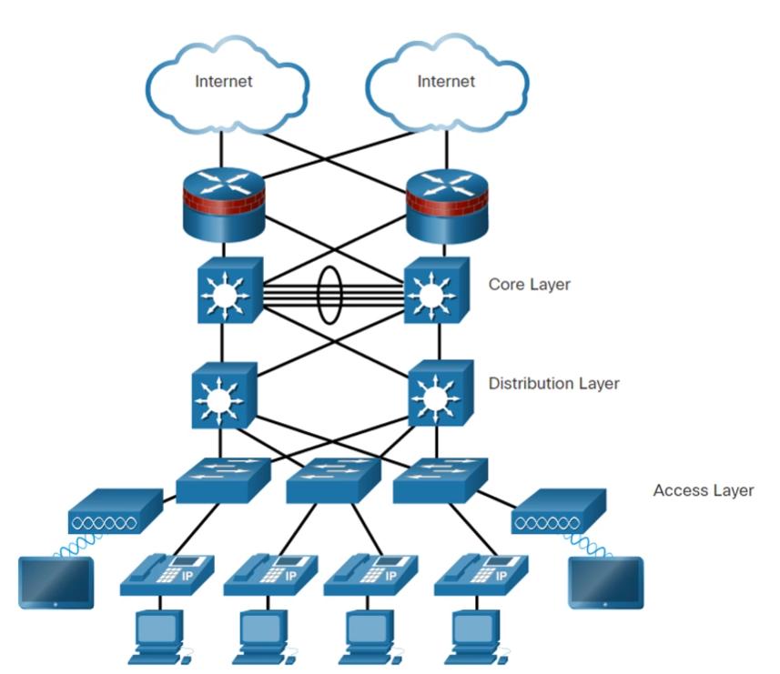

# Network Design

## [Конвергентные сети](https://servergate.ru/articles/konvergentnye-sistemy/)

Современные сети могут передавать различный пользовательский трафик по одному каналу связи. Передача голоса и видео по одной сети
Доп Сервисы:
* Управление вызовами
* Голосовые сообщения
* Мобильная связь
* Автоответчик

Плюсы:
* Одна физическая сеть для разного типа трафика, что экономит деньги, очевидно, т.к не нужно проводить 100500 каналов, каждый для своего типа трафика

Минусы:
* Требуется продуманная архитектура и структурированное проектирование, т.к нужно умело согласовать передачу всех типов трафика.

## [Borderless Network](https://genesisbcs.com/cisco-borderless-network-architecture/)

* Предоставляет платформу для объединения средств проводного и беспроводного доступа, включая применение политик(безопасности), разграничение доступа и управление производительностью устройств разных типов
* Строится на основе масштабируемой и отказоустойчивой иерархической инфраструктуры аппаратного обеспечения
* Пользователи получают повсеместный доступ к ресурсам в любое время
* Должно быть централизованное администрирование таких сетей, которое не должно усложняться с ростом сети
* Способна передавать конвергированные данные

С помощью такой сети можно связывать пользователей любых устройств в любое время в любом месте. Не обязательно должна быть кампусная сеть в одном здании организации. Могут быть удаленные подключения, могут быть мобильные пользователи, которые могут удаленно подключаться в локальную сеть организации.  

Может существовать сеть филиалов, которые объединены одной локальной сетью.

## Принцип построения Borderless Network

* **Иерархичность**
  * Делим сеть на разные уровни, имеющие свои роли. Такое разделение упрощает понимание роли устройства на каждом уровне
  * Иерархичную сеть проще поддерживать, т.к на каждом уровне находится своё оборудование, которое изолировано от оборудования на других уровнях.
* **Модульность**
  * легко масштабировать и внедрять новые сервисы
* **Отказоустойчивость**
  * бесперебойная работа сети. Пользователи ожидают, что ресурсы сети(сервисы) будут доступны постоянно
* **Гибкость**
  * рациональное распределение ресурсов. Каждому пользователю достаётся столько ресурсов, сколько ему реально нужно
  
## Borderless Switched Network

В основе построения таких сетей лежат 2 модели:
1. **Трёхуровневая модель**
   1. 
   2. Подразумевается, что архитектура сети делится на 3 уровня:
      1. Аccess Layer
      2. Distribution Layer
      3. Core Layer
2. **Двухуровневая модель**
   1. 
   2. Похожа на 3 уровневую модель, только Core Layer и Distribution Layer схлопнуты в один уровень Collapsed Layer
   3. Такая модель больше подходит для организаций меньшего размера, с меньшим кол-вом трафика

## Access Layer, Distribution Layer, Core Layer

* **Уровень доступа(Access Layer):**
  * Предоставление доступа пользователю
  * К нему подключаются пользовательские устройства
  * Коммутаторы уровня доступа подключаются к устройствам уровня распределения
* **Уровень распределения(Distribution Layer)**
  * Маршрутизация трафика между подсетями
  * Агрегация трафика
  * Предоставляются услуги по качеству обслуживания для каждого типа трафика. Например повышенное качество аудио сообщений, т.к такой тип трафика не терпит потерь данных
  * Политики доступа(Qos)
* **Уровень Ядра(Core Layer)**
  * Магистраль сеть
  * Через этот уровень происходит объединение с другими сегментами сети, например предоставляется выход в сеть Интернет, а также другие большие части сети нашей организации, например сети фелиалов или разных кампусов
  * Обеспечивает изоляцию сбоев и высокую скорость подключения между большими сегментами сети
  
## Выбор архитектуры
Нужно уметь правильно выбирать архитектуру сети

* 3 уровневую модель рекомендуется использовать для больших организаций, у которых есть несколько филиалов или кампусов. Тогда в главном офисе нужно развернуть уровень ядра, к которому будут подключаться уровни распределения, находящиеся в разных кампусах организации. Либо можно сделать уровень ядра в каждом филиале, а потом связать крупные сегменты сети
* используется при интенсивном обмене трафиком в организации
* подразумевает более большие затраты на оборудование. Например для обеспечения отказоустойчивости необходимо дублировать оборудование и каналы связи, плюс логично, что чтобы обеспечить адекватную работу целых 3 уровней понадобится большое кол-во разных устройств, что может быть дороговато

* менее простая, дешевая и легковесная модель, может не обеспечить хорошим качеством сети
* Рекомендуется для организаций среднего и малого размера, которые находятся внутри одного здания. 
* используется при умеренном или малом обмене трафиком в организации

## Плоские сети

До изобретения крутых и навороченных сетевых архитектур, все подключения проходили в плоских сетях в которых все пользователи были соединены друг с другом одним кабелем(общая шина), либо через коммутатор.
  
Плоская сеть не очень хороший вариант, т.к пользователи могут получать большой объем трафика, который им не предназначается и не требуется для работы, что увеличивает нагрузку на пропускно канал сети, что тормозит сеть

## Иерархические сети

Когда мы делим сеть на уровни, то мы получаем дополнительную гибкость, а именно возможность:
* управлять трафиком,
* ограничивать распространения трафик,
* предоставлять различное качество обслуживания для разных типов трафика,
* обеспечивать политики безопасности 
* подключения беспроводных клиентов и других сервисов по типу IP телефония, мобильная связь
  
В иерархических сетях кроме коммутаторов используются ещё и маршрутизаторы, коммутаторы [3его уровня](https://habr.com/ru/companies/zyxel/articles/531498/) и другие технологии

[Ещё одна статья про коммутатор L3](https://www.fibermall.com/ru/blog/layer-3-switches.htm?srsltid=AfmBOooto7YxQZVkV_UbzDlQh6cFr-kKIDg_iNV_W_iKDvWrX-zRAUsY#)

## Продумывание сети
Чтобы сеть отвечала принципам **Иерархичности, Модульности, Отказоустойчивости, Гибкости** нужно заранее спланировать её архитектуру и то как она будет реализована.
  
Например для обеспечения отказоустойчивости необходимо дублировать разные типы оборудования и каналы связи на уровнях, что позволит создать резервные пути для прохождения трафика. Нужно делать это с умом, т.к может влететь в копеечку, и обеспечивать отказоустойчивость только стратегически важных компонент сети
  

С помощью [агрегирования портов](https://nag.wiki/pages/viewpage.action?pageId=25108332#:~:text=%D0%90%D0%B3%D1%80%D0%B5%D0%B3%D0%B8%D1%80%D0%BE%D0%B2%D0%B0%D0%BD%D0%B8%D0%B5%20%D0%BF%D0%BE%D1%80%D1%82%D0%BE%D0%B2%20%2D%20%D1%8D%D1%82%D0%BE%20%D0%BF%D1%80%D0%BE%D1%86%D0%B5%D1%81%D1%81%20%D0%BE%D0%B1%D1%8A%D0%B5%D0%B4%D0%B8%D0%BD%D0%B5%D0%BD%D0%B8%D1%8F,%D0%BB%D0%BE%D0%B3%D0%B8%D1%87%D0%B5%D1%81%D0%BA%D0%BE%D0%BC%20%D0%BB%D0%B8%D0%BD%D0%BA%D0%B5%20%D0%B8%20%D0%B8%D1%81%D0%BF%D0%BE%D0%BB%D1%8C%D0%B7%D0%BE%D0%B2%D0%B0%D1%82%D1%8C%20%D1%80%D0%B5%D0%B7%D0%B5%D1%80%D0%B2%D0%B8%D1%80%D0%BE%D0%B2%D0%B0%D0%BD%D0%B8%D0%B5.), можем расширить возможности каналов связи, т.е увеличивать пропускную способность одного канала связи между устройствами

Использование протоколов маршрутизации ([OSPF](https://ru.wikipedia.org/wiki/OSPF)) , поддерживающих иерархию устройств в сети, и иерархических сетевых адресов.
  
Подключение беспроводных точек доступа для увеличения числа клиентов

легкое масштабирование иерархических сетей, т.к на выделенных уровней можно просто добавить побольше оборудования.

